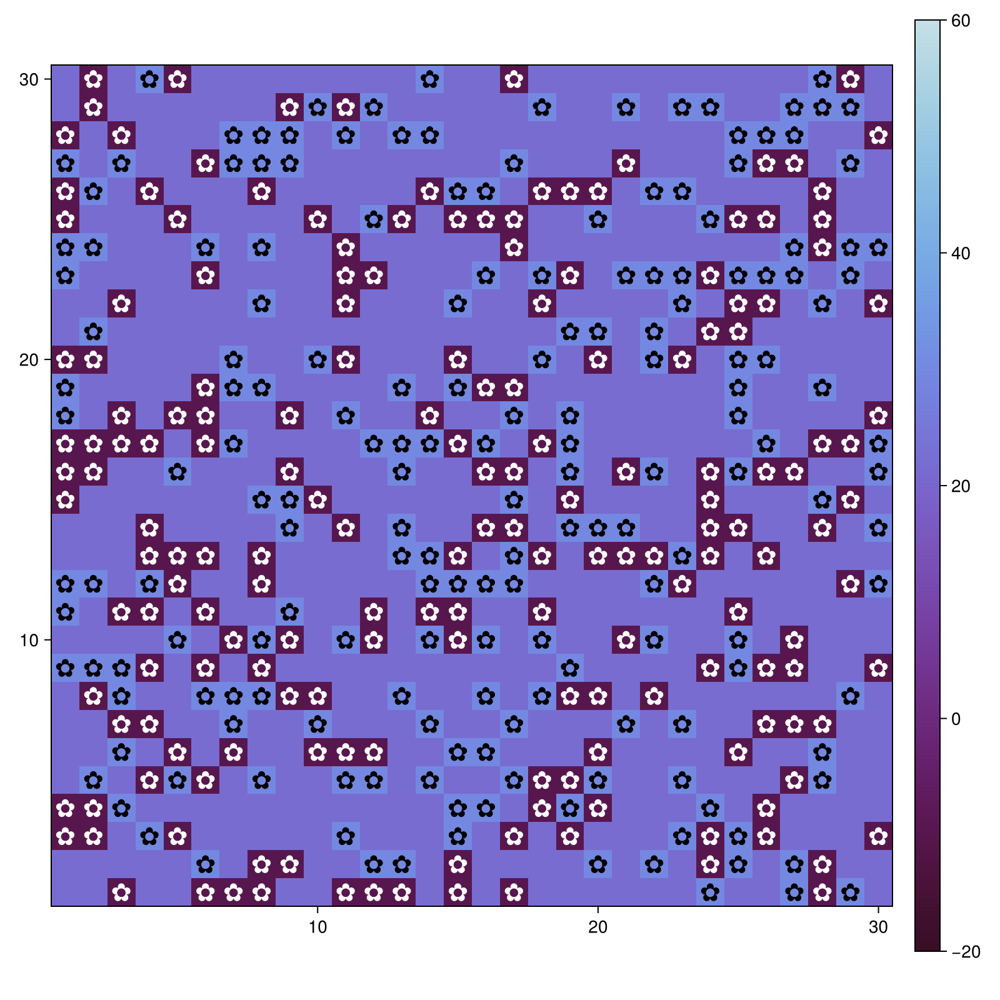
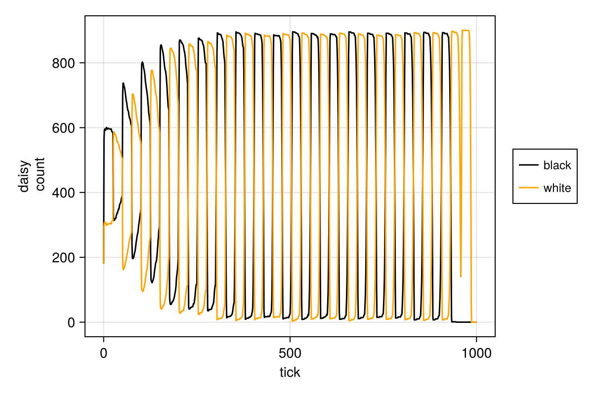
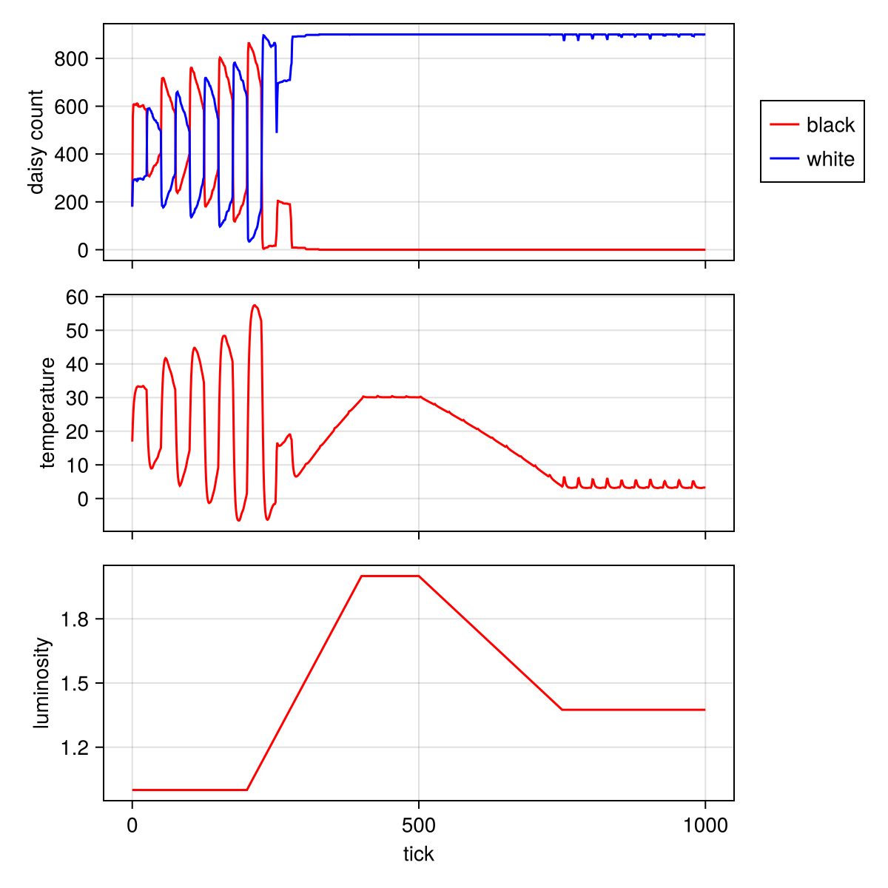

---
execute:
  eval: false
  echo: true

## Author
author:
  name: Тарасова Алина Андреевна
  degrees: студент
  email: 1132236013@rudn.ru
  affiliation:
    - name: Российский университет дружбы народов
      country: Российская Федерация
      postal-code: 117198
      city: Москва
      address: ул. Миклухо-Маклая, д. 6

## Title
title: Лабораторная работа №3
subtitle: Агентный подход и модель Daisyworld
license: CC BY
date: today
date-format: "YYYY-MM-DD"
---

# Информация

## Докладчик

:::::::::::::: {.columns align=center}
::: {.column width="70%"}
  * Тарасова Алина Андреевна
  * студент 2 курса кафедры ММИИИ
  * Российский университет дружбы народов им. П. Лумумбы
  * [1132236013@rudn.ru](mailto:1132236013@rudn.ru)
  * <https://gitverse.ru/aatarasova>
  * <https://github.com/aatarasova>
:::
::: {.column width="30%"}
:::
::::::::::::::

# Вводная часть

## Актуальность

- Агентное моделирование (ABM) позволяет изучать сложные системы "снизу вверх"
- Модель Daisyworld иллюстрирует концепцию саморегуляции и гипотезу Геи
- Подход ABM критически важен, когда поведение системы трудно предсказать из-за нелинейностей и гетерогенности участников
- Julia и пакет `Agents.jl` предоставляют мощные средства для создания и анализа ABM

## Объект и предмет исследования

- Объект: Саморегулирующаяся планетарная система, состоящая из живых организмов и окружающей среды
- Предмет:
  - Агентный подход в имитационном моделировании
  - Модель Daisyworld (взаимодействие маргариток и температуры планеты)
  - Влияние параметров (альбедо, возраст, солнечная активность) на гомеостаз системы

## Цели и задачи

- Изучить принципы агентного моделирования на примере Daisyworld
- Реализовать агентную модель на Julia с использованием `Agents.jl`
- Провести визуализацию динамики модели
- Выполнить параметрическое исследование и проанализировать стабильность системы
- Освоить методы создания анимаций и анализа данных в ABM

## Материалы и методы

- Язык программирования Julia
- Пакеты: `Agents.jl`, `CairoMakie.jl`, `DataFrames.jl`, `DrWatson.jl`
- Литературное программирование: `Literate.jl`
- Оформление отчётов: `Quarto`

# Теоретическая часть

## Агентный подход

**Ключевые компоненты:**
- **Агенты** — активные сущности со свойствами и правилами поведения
- **Среда** — пространство (дискретное, непрерывное), в котором действуют агенты
- **Взаимодействия** — правила, по которым агенты влияют друг на друга и среду

**Основные принципы:**
- **Эмерджентность** — глобальное поведение возникает из локальных взаимодействий
- **Автономия** — агенты действуют независимо
- **Гетерогенность** — агенты могут различаться по характеристикам

## Модель Daisyworld

Модель, предложенная Джеймсом Лавлоком, иллюстрирует гипотезу Геи.

**Агенты:**
- Чёрные маргаритки (низкое альбедо) — поглощают тепло
- Белые маргаритки (высокое альбедо) — отражают тепло

**Среда:**
- Двумерная клеточная сетка
- Динамическая температура, зависящая от солнечной активности и маргариток

## Механизм саморегуляции

1. **Рост**: Маргаритки могут размножаться только в определённом температурном диапазоне.
2. **Влияние**: Чёрные маргаритки нагревают планету, белые — охлаждают.
3. **Обратная связь**: Если становится слишком жарко, выживают и размножаются белые маргаритки, охлаждая планету. Если слишком холодно — чёрные маргаритки нагревают её.

Эта отрицательная обратная связь позволяет поддерживать температуру в комфортном для жизни диапазоне при широком изменении внешнего воздействия (солнечной постоянной).

## Ключевые параметры модели

| Параметр | Описание |
|:---------|:---------|
| `luminosity` | Солнечная постоянная (внешнее воздействие) |
| `albedo_white` / `albedo_black` | Отражательная способность маргариток |
| `surface_albedo` | Альбедо пустой почвы |
| `max_age` | Максимальный возраст маргаритки |
| `scenario` | Сценарий изменения солнечной активности (`:ramp`, `:change`) |

# Выполнение лабораторной работы

## Создание релиза

- Создан новый релиз v.3.0.0 для проекта лабораторной работы

{width=70%}

## Настройка окружения Julia и создание проекта

- Инициализация проекта DrWatson для лабораторной работы `lab03`

```julia
using Pkg
Pkg.add(["DrWatson", "Agents", "CairoMakie", "DataFrames", "Literate"])
using DrWatson
initialize_project("project"; authors="Тарасова Алина", git=false)
cd("project")
```

## Исходный код модели (src/daisyworld.jl)

- Определение типа агента `Daisy` и функций для обновления температуры, диффузии и размножения
- Реализация правил: старение и смерть, размножение в зависимости от температуры, изменение локальной температуры

## Базовая визуализация (scripts/daisyworld.jl)

- Запуск модели и создание тепловых карт температуры с отображением маргариток на разных шагах

{width=70%}
*Рисунок 1: Начальный шаг модели*

## Анимация модели (scripts/daisyworld-animate.jl)

- Создание видео эволюции модели с использованием `abmvideo`

```julia
using CairoMakie
model = daisyworld()
abmvideo(plotsdir("simulation.mp4"), model; 
         title = "Daisy World", frames = 60, 
         plotkwargs...)
```
- Результат выложен на видеохостинг.

## Динамика числа маргариток (scripts/daisyworld-count.jl)

- Сбор данных о численности черных и белых маргариток во времени

{width=70%}
*Рисунок 2: Изменение популяций маргариток*

## Динамика модели (scripts/daisyworld-luminosity.jl)

- Комплексный график: численность маргариток, средняя температура планеты и солнечная активность

{width=70%}
*Рисунок 3: Динамика модели при изменении солнечной активности*

## Параметрическое исследование

- Написаны скрипты для запуска модели с разными параметрами:
  - `daisyworld__param.jl` (визуализация)
  - `daisyworld-count__param.jl` (динамика популяций)
  - `daisyworld-luminosity__param.jl` (динамика модели)

```julia
param_dict = Dict(
    :max_age => [25, 40],
    :init_white => [0.2, 0.8],
    :scenario => [:default, :ramp],
)
# Запуск и сохранение всех комбинаций...
```

## Работа с Jupyter notebooks

- Сгенерированы Jupyter notebooks из литературных скриптов
- Выполнен код для проверки работоспособности

{width=70%}

## Настройка Quarto и интеграция в отчёт

- Конфигурация `_quarto.yml` для поддержки Julia
- Подключение сгенерированных `.qmd` файлов в отчёт

```yaml
engine: julia
julia:
  exeflags: ["--project=../project"]
```

# Результаты

## Визуализация и динамика

- Модель наглядно демонстрирует эмерджентную саморегуляцию: популяции маргариток адаптируются к изменению солнечной активности
- В сценарии `:ramp` (постепенное увеличение и уменьшение светимости) видно, как система сначала компенсирует нагрев (преобладают белые маргаритки), а затем — охлаждение (преобладают черные)
- При достаточном внешнем воздействии система теряет способность к регуляции, и маргаритки вымирают

## Результаты параметрического исследования

- **Максимальный возраст (`max_age`)**: Влияет на скорость обновления популяции. Меньший возраст приводит к более быстрой адаптации к изменениям среды.
- **Начальная доля белых маргариток (`init_white`)**: При высоких значениях система быстрее и эффективнее охлаждается при росте светимости.
- **Сценарий изменения светимости (`scenario`)**: "Плавное" изменение (`:ramp`) позволяет системе адаптироваться, в то время как резкое изменение (`:change`) может привести к гибели популяции.

## Методологические результаты

- Освоен пакет **`Agents.jl`** для агентного моделирования в Julia
- На практике применены методы визуализации (`abmplot`) и анимации (`abmvideo`) ABM
- Проведен систематический сбор данных (`run!`) и их анализ
- Закреплены навыки работы с DrWatson и литературным программированием

# Рекомендации

## Принципы организации работы с ABM

::: incremental
- Всегда начинайте с формального описания агентов, среды и правил взаимодействия
- Используйте `Agents.jl` для стандартизации и производительности
- Применяйте `abmvideo` для создания наглядной анимации, демонстрирующей эмерджентное поведение
- Используйте параметрические исследования для проверки устойчивости системы
:::

## Дальнейшие исследования

::: incremental
- Добавить в модель другие типы маргариток с промежуточным альбедо
- Ввести пространственную гетерогенность почвы (разное альбедо поверхности)
- Исследовать влияние разных функций размножения (не только параболической)
- Перенести агентный подход на сквозные задачи: реализовать модели SIR и Лотки-Вольтерры с помощью `Agents.jl`
:::

# Итоговый слайд

## Выводы

В результате выполнения лабораторной работы:

Изучены основные принципы агентного моделирования  
Реализована и проанализирована модель Daisyworld на Julia с использованием `Agents.jl`  
Проведено визуальное и параметрическое исследование саморегуляции системы  
Освоены инструменты для создания, анализа и документирования ABM-проектов  
Подготовлен отчёт и презентация

---

Главное сообщение: **Агентное моделирование — мощный метод для изучения сложных систем, а экосистема Julia предоставляет все необходимые инструменты для его применения и воспроизводимости научных результатов.**
