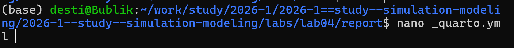
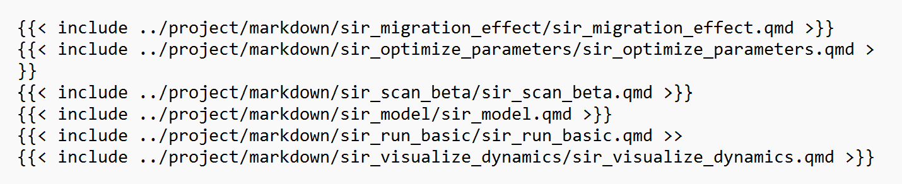

---
## Author
author:
  name: Тарасова Алина Андреевна
  degrees: DSc
  orcid: 0000-0002-0877-7063
  email: 1132236013@rudn.ru
  affiliation:
    - name: Российский университет дружбы народов
      country: Российская Федерация
      postal-code: 117198
      city: Москва
      address: ул. Миклухо-Маклая, д. 6
## Title
title: Лабораторная работа 04
subtitle: Простейший вариант
license: CC BY
date: today
date-format: "YYYY-MM-DD" # Example: 2025-09-06
---

# Информация

## Докладчик

:::::::::::::: {.columns align=center}
::: {.column width="70%"}

  * Тарасова Алина Андреевна
  * студент 2 курса кафедры ММИИИ
  * Российский университет дружбы народов им. П. Лумумбы
  * [1132236013@rudn.ru](mailto:1132236013@rudn.ru)
  * <https://gitverse.ru/aatarasova>
  * <https://github.com/aatarasova>

:::
::: {.column width="30%"}

:::
::::::::::::::

# Вводная часть

## Актуальность

- Агентное моделирование позволяет исследовать сложные системы, где глобальное поведение возникает из локальных взаимодействий
- Классические модели SIR и Лотки-Вольтерры являются сквозными задачами курса
- Необходимо освоить инструментарий агентного моделирования в Julia

## Объект и предмет исследования

- **Объект исследования:** агентные модели SIR и Лотки-Вольтерры
- **Предмет исследования:** реализация классических моделей популяционной динамики в агентном подходе

## Цели и задачи

- Создать агентные модели SIR и Лотки-Вольтерры в Julia
- Преобразовать код в литературный стиль
- Провести параметрическое исследование моделей
- Сгенерировать производные форматы и интегрировать в отчёт

## Материалы и методы

- Язык программирования Julia
- Пакет Agents.jl для агентного моделирования
- Пакет DrWatson.jl для организации проекта
- Пакет Literate.jl для литературного программирования
- Пакеты Plots.jl, CairoMakie.jl для визуализации
- Quarto для формирования отчёта

---

# Создание агентной модели SIR

## Определение агента

```julia
@agent struct Person(GridAgent{2})
    status::Symbol  # :S, :I, :R
    days_infected::Int
end
```

## Правила шага агента

```julia
function agent_step!(agent, model)
    if agent.status == :I
        agent.days_infected += 1
        if agent.days_infected >= recovery_time(model)
            agent.status = :R
        end
    end
    if agent.status == :S
        # Заражение при контакте с I
    end
end
```

## Код для формата `pdf`

Настройка окружения Julia:

```bash
julia --project=. scripts/sir_abm_basic.jl
```

## Код для формата `html`

Подключение пакетов:

```julia
using DrWatson
@quickactivate "project"
using Agents
using Plots
using CairoMakie
```

---

{#fig-julia-start width=70%}


{#fig-julia-start width=70%}


# Параметрическое исследование SIR

## Сканирование параметра β

```julia
beta_values = [0.05, 0.1, 0.15, 0.2, 0.25]

for beta in beta_values
    model = initialize_model(beta=beta)
    run!(model, 100)
    save_results(model, beta)
end
```

## Результаты

- С увеличением β пик заболеваемости выше
- Пик наступает раньше
- Итоговое число переболевших возрастает

---

# Агентная модель Лотки-Вольтерры

## Определение агентов

```julia
@agent struct Rabbit(GridAgent{2})
    energy::Float64
end

@agent struct Fox(GridAgent{2})
    energy::Float64
end
```

## Правила взаимодействия

```julia
function agent_step!(rabbit::Rabbit, model)
    # Размножение с вероятностью α
    if rand() < model.α
        # Создание нового кролика
    end
end

function agent_step!(fox::Fox, model)
    # Охота на кроликов
    # Пополнение энергии
    # Размножение при достижении порога
end
```

---

# Литературное программирование

## Процессор Literate.jl

- Строки с `#` интерпретируются как Markdown
- Остальные строки — код на Julia
- Поддержка QuartoFlavor для генерации документации

## Создание производных форматов

```bash
julia --project=. scripts/tangle.jl scripts/sir_abm_basic.jl
```
{#fig-project-create width=70%}

## Форматы

- Чистый код Julia
- Jupyter Notebook (.ipynb)
- Документация Quarto (.qmd)

---

# Интеграция в отчёт

## Настройка `_quarto.yml`

```yaml
engine: julia
julia:
  exeflags: ["--project=../project"]

{#fig-project-create width=70%}
```

## Подключение файлов

{#fig-project-create width=70%}

---

# Результаты

## Динамика агентной модели SIR

- Агентная модель демонстрирует экспоненциальный рост I
- Пик заболеваемости достигается при исчерпании восприимчивых
- Пространственная структура создаёт локальные очаги

## Динамика агентной модели Лотки-Вольтерры

- Циклические колебания численности
- Сдвиг фаз между пиками хищников и жертв
- Фазовый портрет — замкнутые траектории

---

# Итоговый слайд

- **Агентный подход** позволяет учитывать пространственную структуру и индивидуальные различия агентов
- **Литературное программирование** обеспечивает воспроизводимость и документированность кода
- **Параметрическое исследование** выявило ожидаемые зависимости динамики от ключевых параметров
- **Интеграция в Quarto** даёт единый формат отчёта с исполняемым кодом

---

# Рекомендую

## Принцип организации кода

- Использовать DrWatson для управления проектом
- Хранить многократно используемые функции в `src/`
- Сохранять результаты в `data/` с помощью `savename()`

## Визуализация

- Использовать abmplot для пространственного отображения агентов
- Строить графики динамики численности
- Добавлять спектральный анализ для определения периода колебаний

## Количество сущностей

- 2 типа агентов (SIR: S, I, R; LV: жертвы, хищники)
- 4–5 ключевых параметров модели
- 3–4 основных графика на модель

---