---
## Author
author:
  name: Тарасова Алина Андреевна
  degrees: DSc
  orcid: 0000-0002-0877-7063
  email: 1132236013@rudn.ru
  affiliation:
    - name: Российский университет дружбы народов
      country: Российская Федерация
      postal-code: 117198
      city: Москва
      address: ул. Миклухо-Маклая, д. 6
## Title
title: Лабораторная работа 05
subtitle: Простейший вариант
license: CC BY
date: today
date-format: "2026-04-12" # Example: 2025-09-06
---

# Информация

## Докладчик

:::::::::::::: {.columns align=center}
::: {.column width="70%"}

  * Тарасова Алина Андреевна
  * студент 2 курса кафедры ММИИИ
  * Российский университет дружбы народов им. П. Лумумбы
  * [1132236013@rudn.ru](mailto:1132236013@rudn.ru)
  * <https://gitverse.ru/aatarasova>
  * <https://github.com/aatarasova>

:::
::: {.column width="30%"}

:::
::::::::::::::

# Вводная часть

## Актуальность

- Сети Петри — мощный формализм для моделирования дискретных систем с параллельными процессами
- Позволяют анализировать проблемы синхронизации, взаимоблокировок и распределения ресурсов
- Задача "Обедающих философов" — классический пример проблем параллельного программирования

## Цели и задачи

**Цель:** освоение аппарата сетей Петри для моделирования параллельных процессов

**Задачи:**
- Изучить основные понятия сетей Петри
- Реализовать модель "Обедающих философов" в Julia
- Провести анализ взаимоблокировок и голодания
- Освоить литературное программирование

## Материалы и методы

- Язык Julia
- Пакет Petri.jl для сетей Петри
- Пакет DrWatson.jl для организации проекта
- Пакет Literate.jl для литературного программирования
- Plots.jl / CairoMakie.jl для визуализации
- Quarto для отчётов

---

# Теоретическое введение

## Сети Петри: основные понятия

**Элементы сети Петри:**
- **Позиции** (круги) — состояния системы или ресурсы
- **Переходы** (прямоугольники) — события или действия
- **Дуги** (стрелки) — связи между позициями и переходами
- **Фишки** (точки) — наличие ресурсов или активность

## Правила срабатывания перехода

**Условие:** каждая входная позиция должна содержать фишек не меньше кратности дуги

**Результат:** 
- Из входных позиций фишки изымаются
- В выходные позиции фишки добавляются

## Задача "Обедающих философов"

**Условие:**
- N философов за круглым столом
- Между соседями — одна вилка
- Для еды нужны две вилки

**Состояния философа:** думает → голоден → ест

## Проблемы параллельных систем

| Проблема | Описание |
|----------|----------|
| **Взаимоблокировка** | Каждый взял по одной вилке и ждёт вторую |
| **Голодание** | Философ никогда не получает обе вилки |

**Способы предотвращения:**
- Арбитр (центральный управляющий процесс)
- Асимметричное взятие вилок
- Ограничение количества едящих

---

# Выполнение лабораторной работы

## Создание релиза

Создан новый релиз v.5.0.0

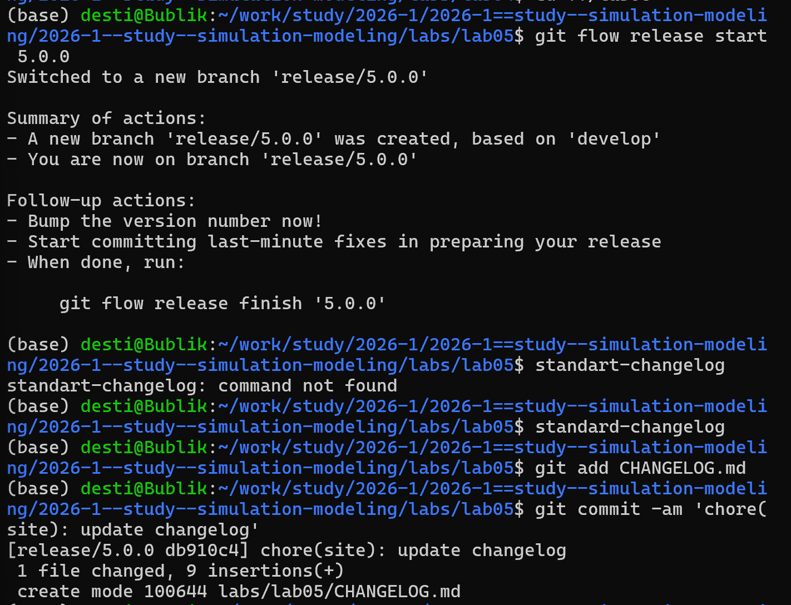{width=60%}

## Настройка окружения Julia

Запуск Julia и установка пакетов

{width=60%}

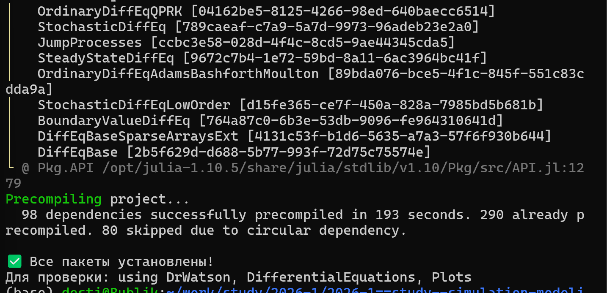{width=60%}

## Установка пакетов для скриптов

{width=60%}

{width=60%}

{width=60%}

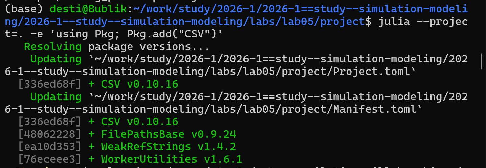{width=60%}

## Запуск скрипта dining_philosophers.jl

{width=60%}

График результатов моделирования с арбитром:

{width=60%}

## Jupyter Notebook

{width=60%}

## Запуск скрипта dining_philosophers_animation.jl

{width=60%}

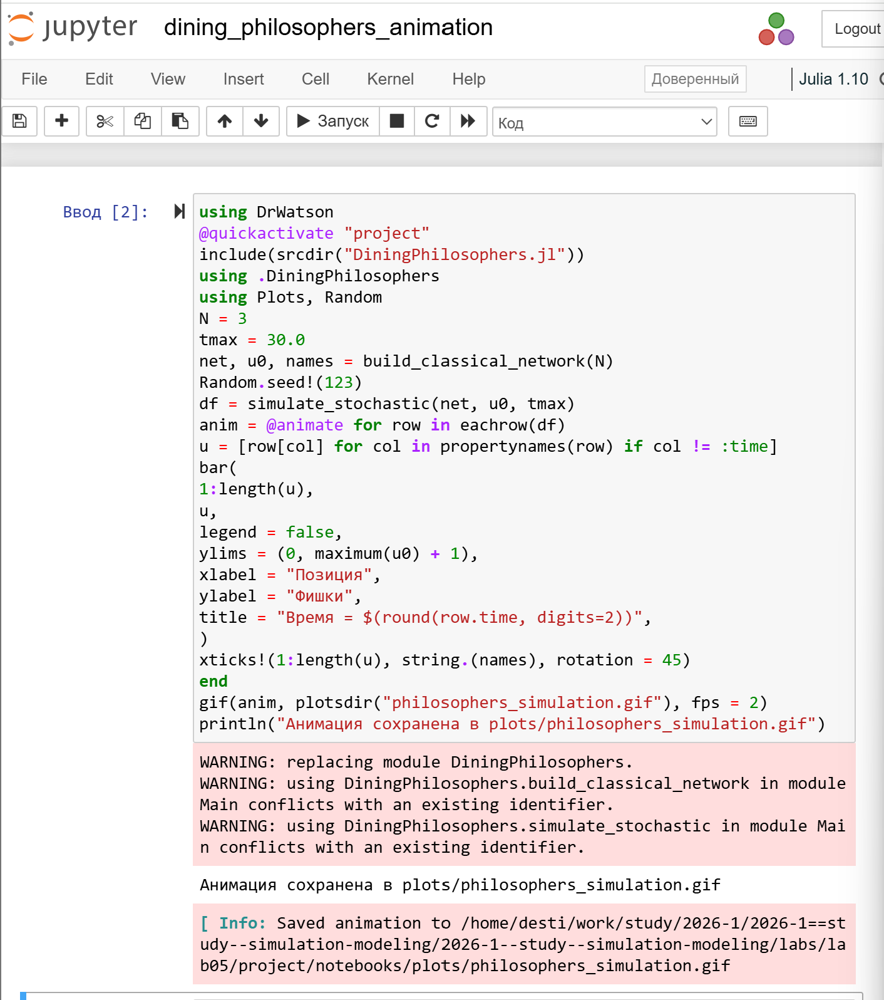{width=60%}

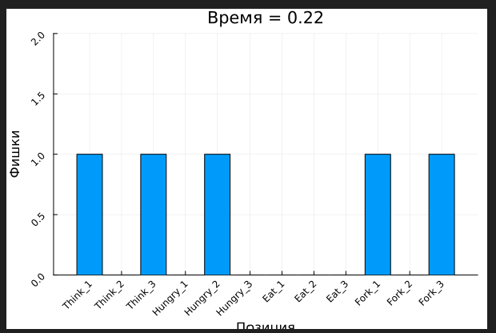{width=60%}

## Запуск скрипта dining_philosophers_report.jl

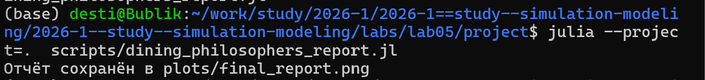{width=60%}

{width=60%}

График финального отчёта:

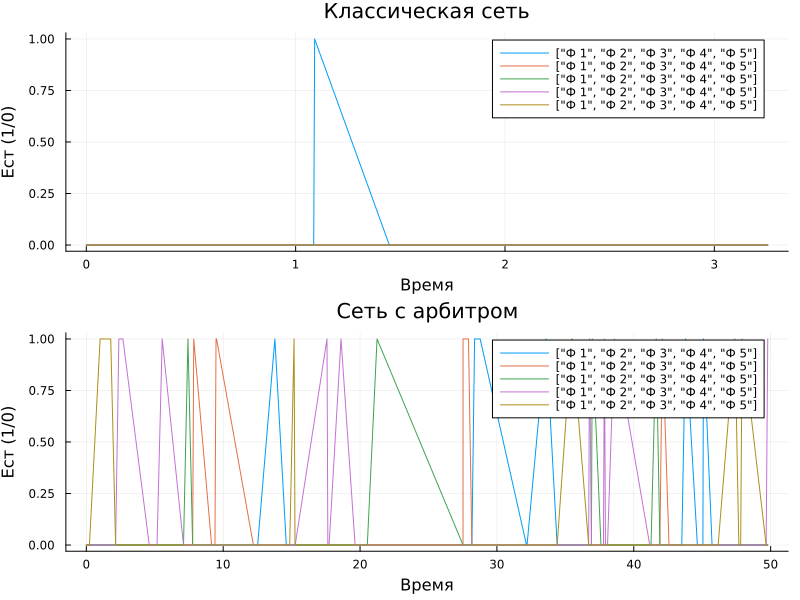{width=60%}

## Создание производных форматов

Установка пакетов для производных форматов:

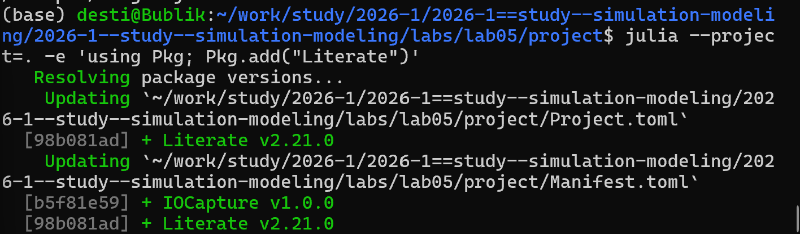{width=60%}

Создание производных форматов:

{width=60%}

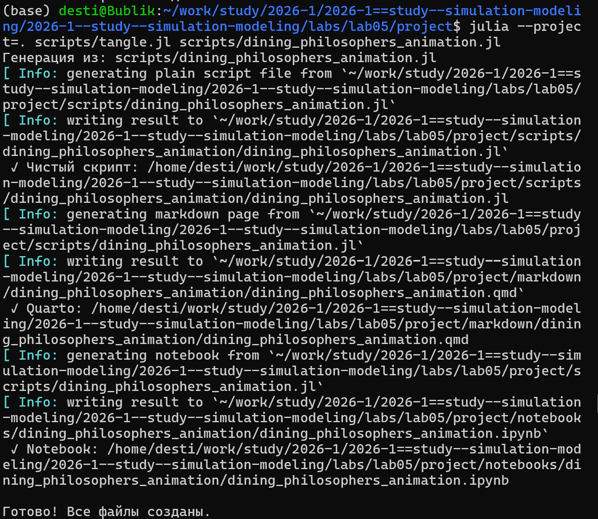{width=60%}

{width=60%}

## Проверка результатов

Проверка созданных файлов в папке plots:

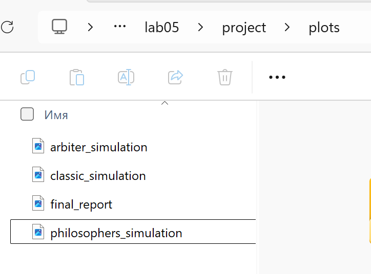{width=60%}

## Настройка Quarto

Настройка _quarto.yml для поддержки Julia:

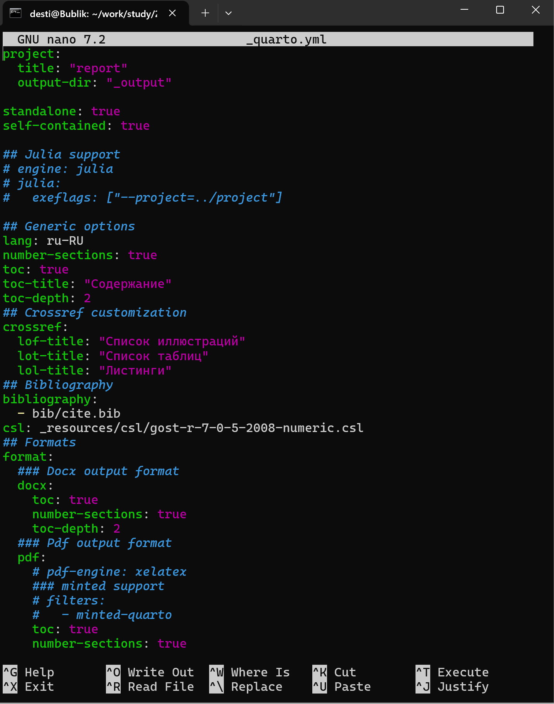{width=60%}

Подключение файлов описания программ:

{width=60%}

---

# Результаты

## Итоги выполнения

- Реализована модель "Обедающих философов" с помощью сетей Петри
- Проведён анализ взаимоблокировки и голодания
- Реализован механизм предотвращения deadlock через арбитра
- Построены графики состояния философов во времени
- Создана анимация процесса моделирования

## Литературное программирование

- Все скрипты оформлены в стиле Literate.jl
- Сгенерированы: чистый код, Jupyter Notebook, документация Quarto
- Документация интегрирована в итоговый отчёт

---

# Выводы

## Основные результаты

1. **Освоен аппарат сетей Петри** — реализована модель задачи "Обедающих философов" с использованием пакета Petri.jl

2. **Проведён анализ модели** — выявлены проблемы взаимоблокировки и голодания, реализован механизм предотвращения deadlock

3. **Выполнена визуализация** — построены графики состояния философов, создана анимация процесса

4. **Освоено литературное программирование** — сгенерированы чистый код, Jupyter Notebook и документация Quarto

5. **Создан интегрированный отчёт** в Quarto с результатами моделирования

---

# Итоговый слайд

- **Сети Петри** — эффективный инструмент для моделирования параллельных процессов
- **Задача "Обедающих философов"** — классический пример проблем синхронизации
- **Литературное программирование** — обеспечивает воспроизводимость и документированность кода
- **Quarto** — позволяет создавать интегрированные отчёты с исполняемым кодом

---

# Список литературы

1. Имитационное моделирование. Практикум
   https://esystem.rudn.ru/pluginfile.php/3094278/modeling-lab.pdf
