---
## Author
author:
  name: Тарасова Алина Андреевна
  degrees: DSc
  orcid: 0000-0002-0877-7063
  email: 1132236013@rudn.ru
  affiliation:
    - name: Российский университет дружбы народов
      country: Российская Федерация
      postal-code: 117198
      city: Москва
      address: ул. Миклухо-Маклая, д. 6

## Title
title: "Отчёт по лабораторной работе 05"
subtitle: "Простейший вариант"
license: "CC BY"
---

# Цель работы

Целью данной лабораторной работы является освоение аппарата сетей Петри и его применение для моделирования параллельных процессов на примере классической задачи "Обедающих философов". В рамках работы необходимо:

Изучить основные понятия и принципы сетей Петри (позиции, переходы, дуги, фишки, правила срабатывания).

Реализовать модель задачи "Обедающих философов" с использованием сетей Петри в среде Julia.

Провести анализ модели на наличие взаимоблокировок (deadlock) и голодания (starvation).

Освоить практику литературного программирования для документирования кода моделей.

Научиться интегрировать результаты моделирования (код, графики, Jupyter Notebook) в единый отчёт с использованием Quarto.

# Задание

В соответствии с методическими указаниями, в рамках лабораторной работы необходимо выполнить следующие этапы:

1. Создание рабочего пространства:

Создать рабочий каталог для курса и для лабораторной работы №5.

Установить необходимые пакеты Julia (DrWatson, Petri, Plots, DataFrames, Literate, IJulia, CairoMakie).

2. Реализация модели "Обедающих философов" с помощью сетей Петри:

Разработать сеть Петри для задачи с N философами.

Определить позиции (состояния философов, вилки) и переходы (взятие вилок, еда, возврат вилок, думание).

Реализовать базовый сценарий моделирования.

Преобразовать код в литературный стиль (Literate.jl) с подробными комментариями.

Сгенерировать из литературного кода: чистый код, Jupyter Notebook, документацию в формате Quarto.

Интегрировать сгенерированную документацию в отчёт.

3. Анализ модели:

Провести симуляцию модели для разного числа философов.

Проанализировать возможность возникновения взаимоблокировки.

Реализовать механизм предотвращения deadlock (например, через арбитра).

4. Визуализация:

Построить графики состояния философов во времени.

Создать анимацию процесса.

5. Документирование:

Настроить файл _quarto.yml для поддержки выполнения кода Julia.

Скомпилировать итоговый отчёт, содержащий все разделы, графики и включённые фрагменты кода.

Разместить все результаты (код, данные, графики) в репозитории Git.

# Теоретическое введение

## Сети Петри: основные понятия

Сеть Петри — это математический формализм для моделирования дискретных систем с параллельными и асинхронными процессами. Она была предложена Карлом Адамовым Петри в 1962 году. Сети Петри позволяют описывать и анализировать системы, в которых одновременно протекают несколько процессов, конкурирующих за общие ресурсы.

Основными элементами сети Петри являются позиции, переходы, дуги и фишки. Позиции изображаются в виде кругов и представляют собой состояния системы или ресурсы. Переходы изображаются в виде прямоугольников и обозначают события или действия, которые могут происходить в системе. Дуги — это стрелки, соединяющие позиции с переходами и переходы с позициями, они показывают, какие ресурсы потребляются или производятся при срабатывании перехода. Фишки — это точки внутри позиций, которые указывают на наличие ресурсов или активность определённого состояния.

Математически сеть Петри задаётся набором позиций, набором переходов, множеством дуг, весовой функцией, определяющей кратность каждой дуги, и начальной маркировкой, которая задаёт начальное распределение фишек по позициям.

## Правила срабатывания перехода

Переход в сети Петри может сработать только при выполнении определённого условия. Для срабатывания перехода необходимо, чтобы каждая входная позиция этого перехода содержала количество фишек, не меньшее кратности входной дуги. Если это условие выполняется, переход считается активным и может сработать.

При срабатывании перехода происходит следующее: из каждой входной позиции изымается количество фишек, равное кратности входной дуги, а в каждую выходную позицию добавляется количество фишек, равное кратности выходной дуги. Таким образом, маркировка сети изменяется, отражая новое состояние системы.

## Задача "Обедающих философов"

Классическая задача синхронизации, сформулированная Эдсгером Дейкстрой в 1965 году, наглядно демонстрирует проблемы, возникающие при организации доступа к общим ресурсам в параллельных системах.

Условие задачи формулируется следующим образом. За круглым столом сидят несколько философов. Перед каждым философом стоит тарелка с едой. Между каждыми двумя соседними философами лежит одна вилка. Каждый философ может находиться в одном из трёх состояний: он может думать, быть голодным или есть. Для того чтобы поесть, философу необходимы две вилки — левая и правая. Если философ не может взять обе вилки, он ждёт. После того как философ поел, он кладёт вилки на место и возвращается к состоянию размышлений.

В этой задаче могут возникать типичные проблемы параллельных систем. Взаимоблокировка происходит в ситуации, когда каждый философ взял по одной вилке и ждёт вторую. В результате ни один из философов не может продолжать выполнение, и система полностью останавливается. Голодание возникает, когда один или несколько философов никогда не получают доступа к вилкам из-за несправедливого распределения ресурсов.

Для предотвращения взаимоблокировки существуют различные подходы. Можно ввести арбитра — центральный управляющий процесс, который разрешает философам брать вилки. Можно использовать асимметричное взятие вилок, например, когда чётные философы сначала берут левую вилку, а затем правую, а нечётные — наоборот. Также можно ограничить количество философов, которые могут есть одновременно, до числа, меньшего общего количества философов.

## Инструменты реализации

В данной работе используется экосистема языка программирования Julia. Пакет Petri.jl предоставляет инструменты для работы с сетями Петри. Пакет DrWatson.jl используется для организации воспроизводимых научных проектов и управления данными. Пакет Literate.jl позволяет применять методологию литературного программирования, при которой код и документация создаются из одного исходного файла. Для визуализации результатов моделирования применяются библиотеки Plots.jl и CairoMakie.jl. Для формирования итогового отчёта используется система Quarto, которая поддерживает интеграцию исполняемого кода Julia.

# Выполнение лабораторной работы

### 1. Создание нового релиза

Создаем новый релиз v.4.0.0 и обновляем информацию по релизу v.4.0.0

{#fig-release width=70%}

### 2. Настройка окружения Julia

Запускаем Julia и установку пакетов

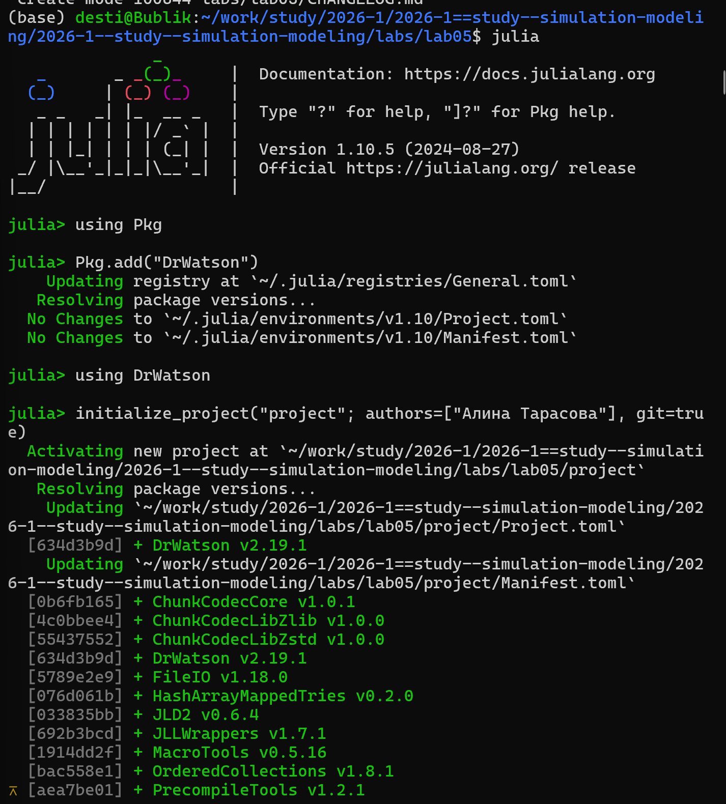{#fig-julia-start width=70%}

{#fig-julia-start width=70%}

### 3. Запуск скриптов и тема работы

Устанавливаем необходимые пакеты для первого скрипта

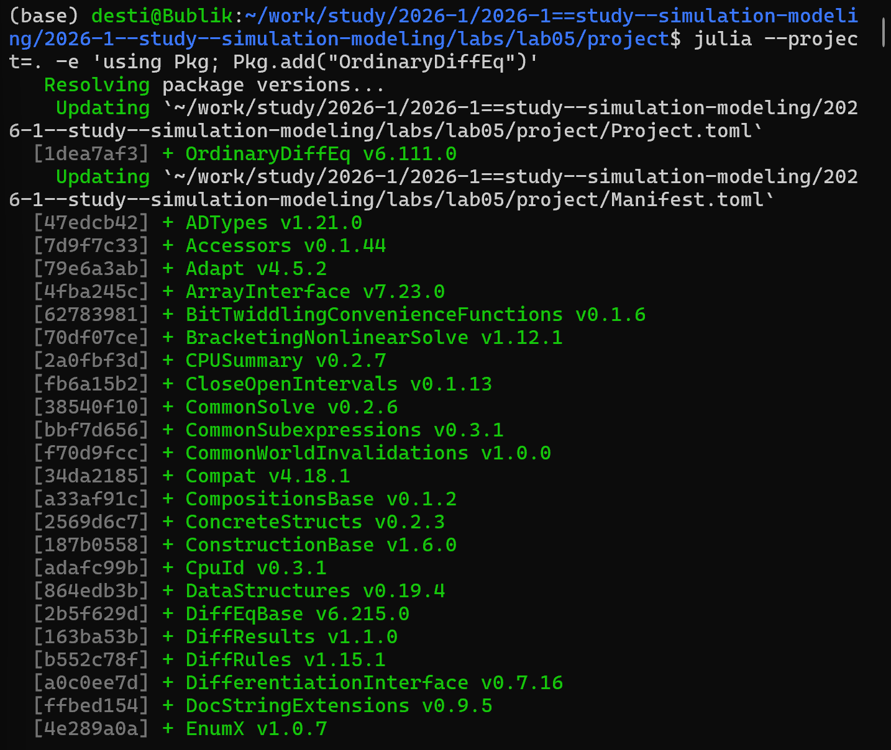{#fig-project-create width=70%}

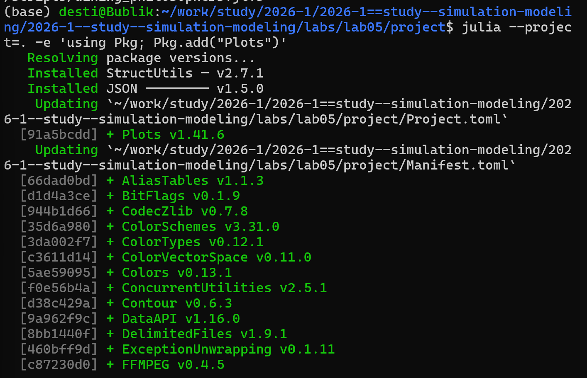{#fig-project-create width=70%}

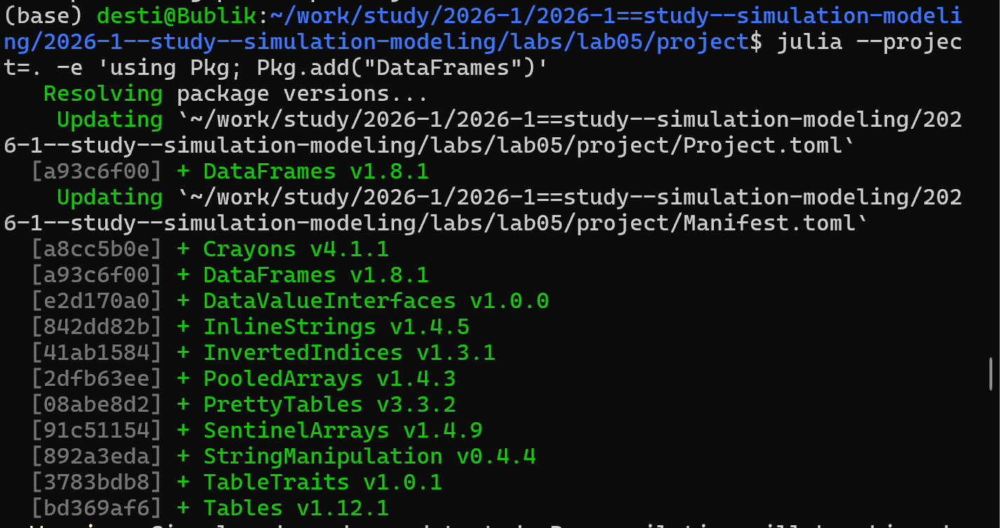{#fig-project-create width=70%}

{#fig-project-create width=70%}

Запуск первого скрипта scripts/dining_philosophers.jl

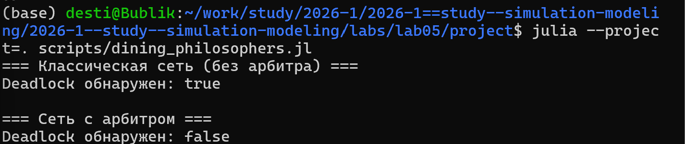{#fig-project-create width=70%}

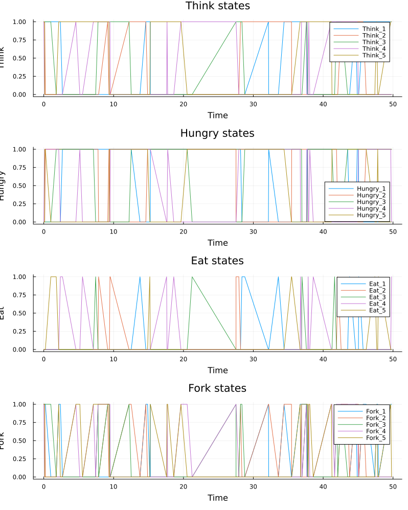{#fig-project-create width=70%}

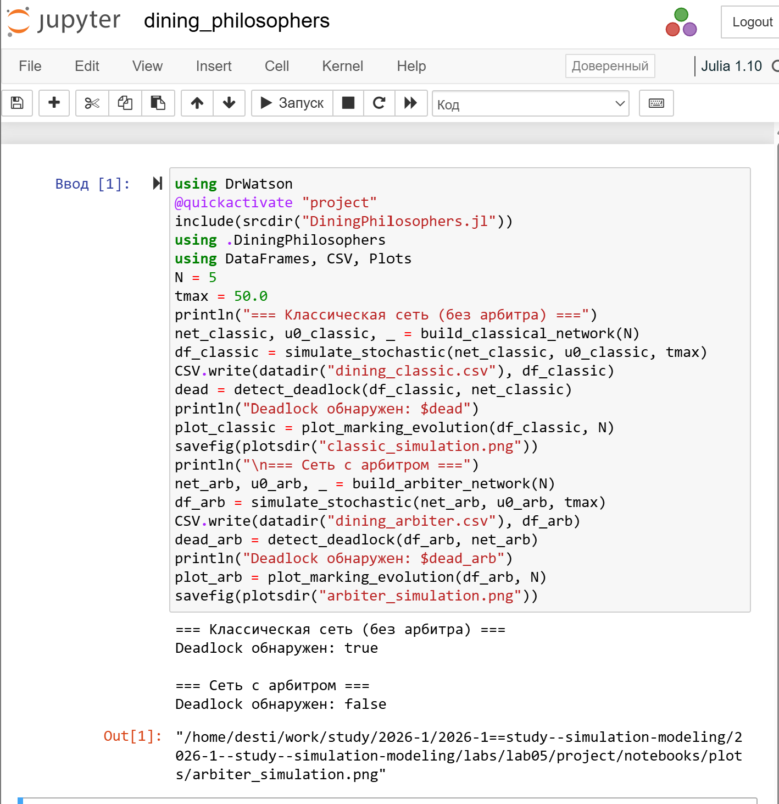{#fig-project-create width=70%}

Создание, запуск следующего скрипта scripts/dining_philosophers_animation.jl и создание его производных форматов

{#fig-project-create width=70%}

{#fig-project-create width=70%}

{#fig-project-create width=70%}

Далее снова перехожу в директорию проекта и создаю и запускаю следующий скрипт scripts/dining_philosophers_report.jl

{#fig-project-create width=70%}

{#fig-project-create width=70%}

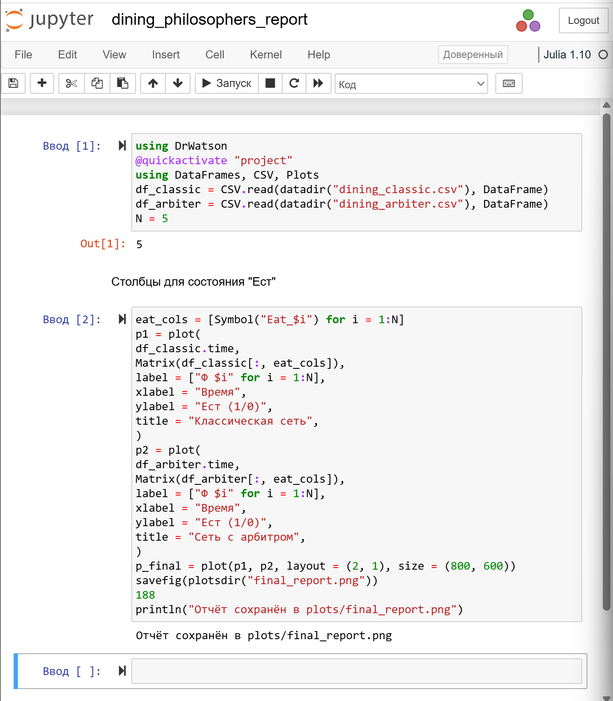{#fig-project-create width=70%}

Устанавливаем необходимые пакеты для производных форматов

{#fig-project-create width=70%}

Создаем производные форматы от скриптов 

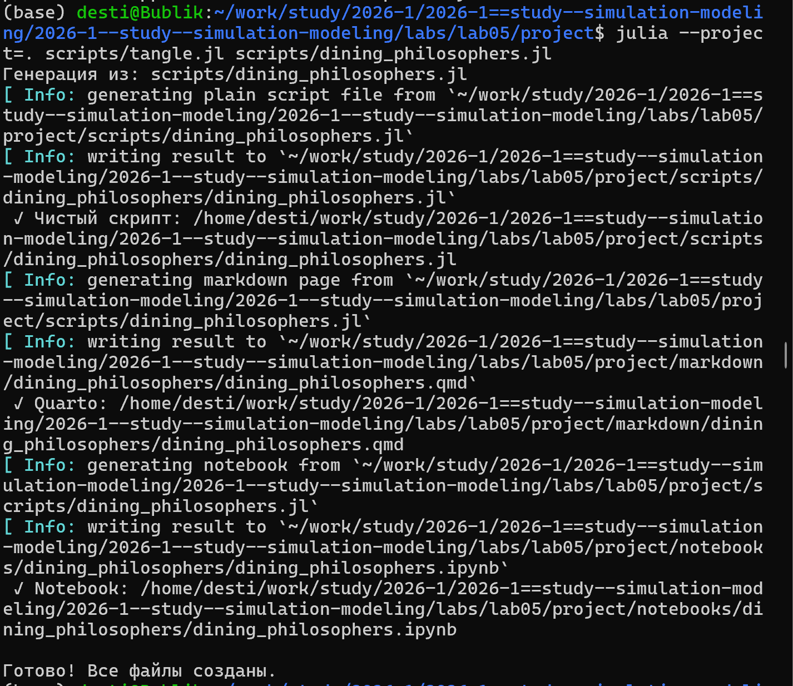{#fig-project-create width=70%}

{#fig-project-create width=70%}

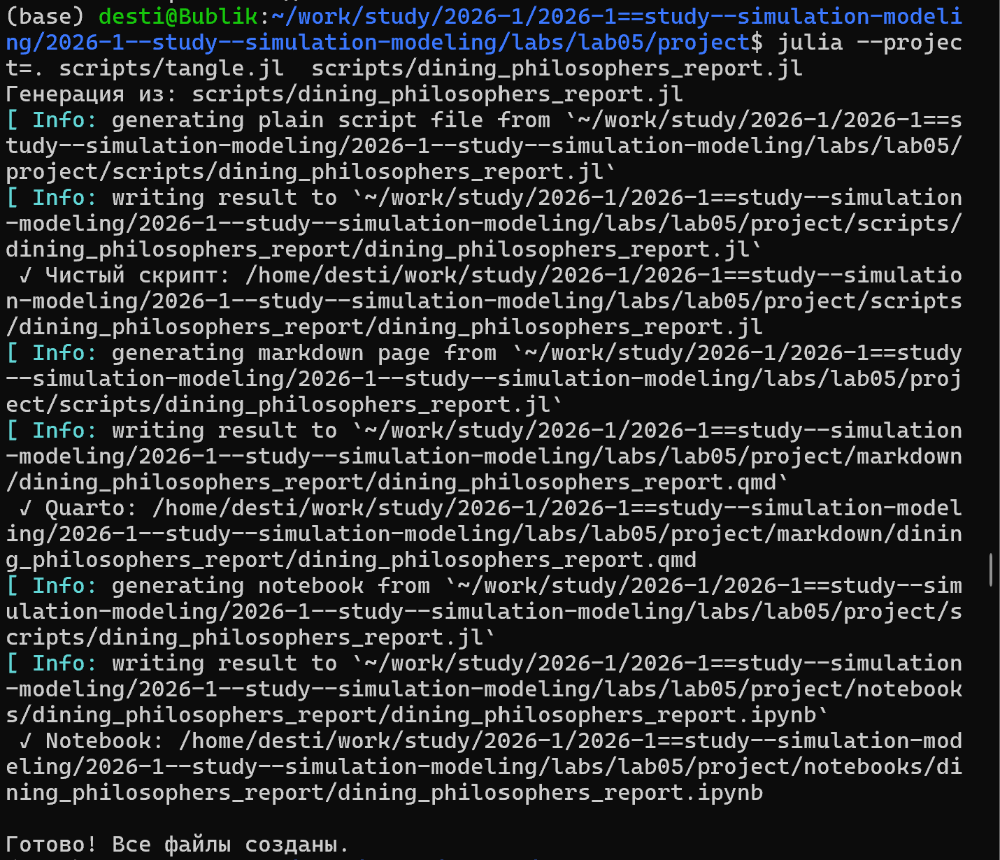{#fig-project-create width=70%}

Проверяю, что создались нужные файлы в папке plots

{#fig-project-create width=70%}

В каталоге отчёта в файл _quarto.yml включаем поддержку кода julia

{#fig-project-create width=70%}

В файле отчёта подключаем файл описания программ

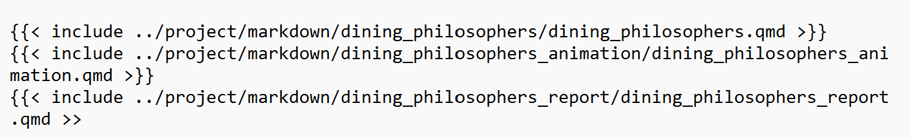{#fig-project-create width=70%}



{{< include ../project/markdown/dining_philosophers_report/dining_philosophers_report.qmd >>

# Выводы

В ходе выполнения лабораторной работы №5 были достигнуты следующие результаты:

Освоен аппарат сетей Петри. Изучены основные понятия: позиции, переходы, дуги, фишки, правила срабатывания. Реализована модель классической задачи "Обедающих философов" с использованием пакета Petri.jl в Julia.

Проведён анализ модели. Выявлены потенциальные проблемы параллельных систем — взаимоблокировка (deadlock) и голодание (starvation). Реализован механизм предотвращения deadlock с помощью арбитра.

Выполнена визуализация результатов. Построены графики состояния философов во времени, создана анимация процесса моделирования, что позволяет наглядно наблюдать за распределением ресурсов.

Освоено литературное программирование с Literate.jl. Из одного исходного файла сгенерированы чистый код, Jupyter Notebook и документация Quarto, что обеспечивает воспроизводимость и документированность кода.

Создан интегрированный отчёт в Quarto, включающий все результаты моделирования, графики и листинги кода. Файлы проекта размещены в репозитории Git.

# Список литературы{.unnumbered}

::: {#refs}
:::
Имитационное моделирование. Практикум https://esystem.rudn.ru/pluginfile.php/3094278/modeling-lab.pdf