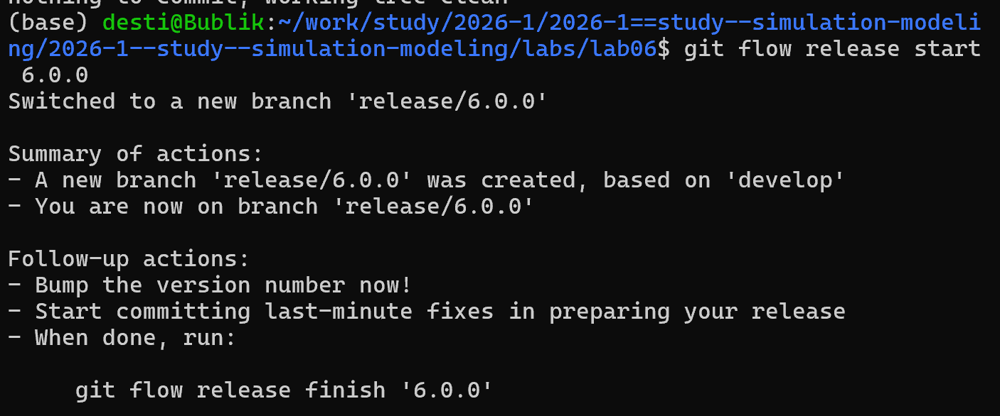
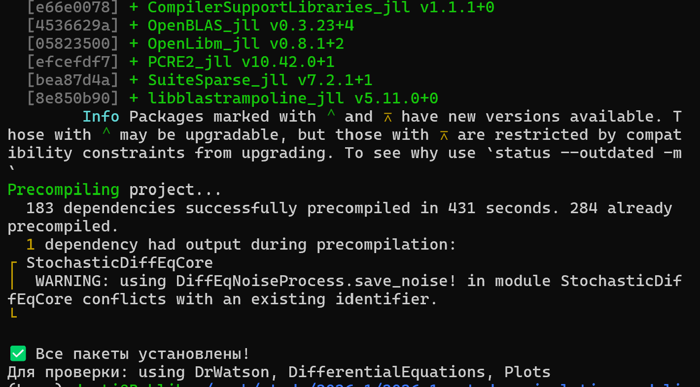
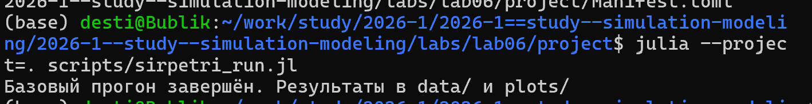
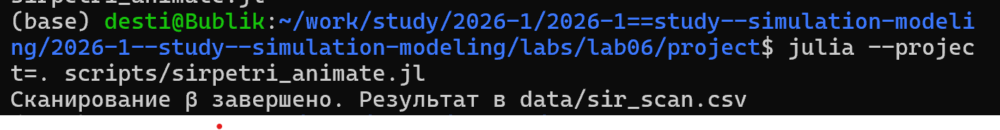
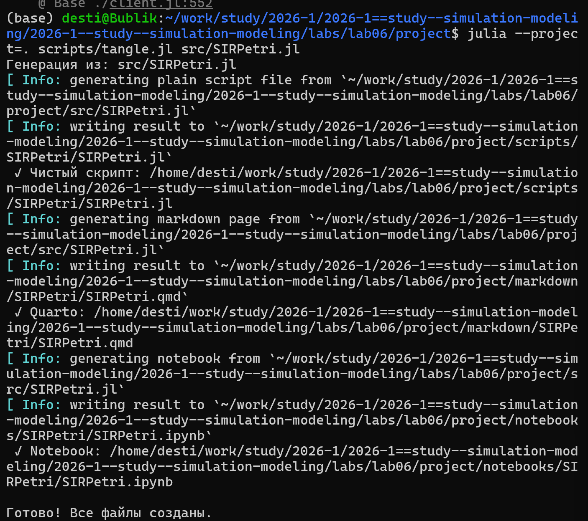

---
## Author
author:
  name: Тарасова Алина Андреевна
  degrees: DSc
  orcid: 0000-0002-0877-7063
  email: 1132236013@rudn.ru
  affiliation:
    - name: Российский университет дружбы народов
      country: Российская Федерация
      postal-code: 117198
      city: Москва
      address: ул. Миклухо-Маклая, д. 6
## Title
title: Лабораторная работа 06
subtitle: Простейший вариант
license: CC BY
date: today
date-format: "2026-04-25" # Example: 2025-09-06
---

# Информация

## Докладчик

:::::::::::::: {.columns align=center}
::: {.column width="70%"}

  * Студент: Тарасова Алина Андреевна
  * Группа: НФИбд-01-23
  * Кафедра теории вероятностей и кибербезопасности
  * Российский университет дружбы народов им. П. Лумумбы
  * [student@rudn.ru](1132236013@rudn.ru)

:::
::: {.column width="30%"}

:::
::::::::::::::

# Вводная часть

## Актуальность

- Моделирование эпидемий — важная задача для прогнозирования распространения инфекций
- Сети Петри позволяют наглядно описывать параллельные и асинхронные процессы
- Сравнение детерминированного и стохастического подходов даёт полную картину динамики
- Необходима автоматизация расчётов и визуализации для быстрого анализа сценариев

## Объект и предмет исследования

- Объект: эпидемиологическая модель SIR (Susceptible–Infectious–Recovered)
- Предмет: реализация модели SIR с использованием сетей Петри в языке Julia

## Цели и задачи

- Реализовать модель SIR на сетях Петри
- Выполнить детерминированное и стохастическое моделирование
- Исследовать чувствительность модели к параметру заражения β
- Создать анимацию динамики эпидемии
- Преобразовать код в литературный стиль и сгенерировать отчётные форматы

## Материалы и методы

- Язык программирования: Julia
- Пакеты: `AlgebraicPetri`, `OrdinaryDiffEq`, `Plots`, `DataFrames`, `Random`
- Детерминированный метод: решение ОДУ (Tsit5)
- Стохастический метод: прямой алгоритм Гиллеспи (SSA)
- Визуализация: Graphviz, Plots
- Генерация отчётов: Literate, Jupyter Notebook, Quarto

# Создание модели SIR

## Сеть Петри для SIR

- Состояния: S (восприимчивые), I (инфицированные), R (выздоровевшие)
- Переходы:
  - `infection`: S + I → I + I (скорость β)
  - `recovery`: I → R (скорость γ)
- Начальная маркировка: S=990, I=10, R=0

## Детерминированная симуляция

- Строится система обыкновенных дифференциальных уравнений по закону действующих масс
- Решается численно методом Tsit5
- Результат: плавные кривые S(t), I(t), R(t)

## Стохастическая симуляция

- Используется прямой метод Гиллеспи
- На каждом шаге вычисляются пропускные способности:
  - `a_inf = β * S * I`
  - `a_rec = γ * I`
- Случайным образом выбирается событие и время до него
- Результат: ступенчатые траектории с флуктуациями

# Выполнение лабораторной работы

## 1. Создание нового релиза

Создан релиз v.6.0.0, обновлена информация по v.4.0.0

{#fig-release width=70%}

## 2. Настройка окружения Julia

Установлены необходимые пакеты: `AlgebraicPetri`, `OrdinaryDiffEq`, `Plots`, `DataFrames`, `Random`

{#fig-julia-packages width=70%}

## 3. Запуск базового скрипта `sirpetri_run.jl`

Выполнена детерминированная и стохастическая симуляция (β=0.3, γ=0.1, tmax=100)

{#fig-run width=70%}

## Результаты базового прогона

**Детерминированный график** – классический пик эпидемии

{#fig-det width=70%}

**Стохастический график** – видны случайные флуктуации

{#fig-stoch width=70%}

## 4. Сканирование параметра β (`sirpetri_scan_parameters.jl`)

- β от 0.1 до 0.8 с шагом 0.05
- Для каждого β вычислен пик I и конечное R

{#fig-scan width=70%}

## График чувствительности к β

При малых β эпидемии нет. С ростом β пик I и конечное R растут до насыщения.

{#fig-sensitivity width=70%}

## 5. Анимация динамики (`sirpetri_animate.jl`)

Создан GIF-файл, показывающий изменение S, I, R во времени

{#fig-animate width=70%}

## 6. Итоговый отчёт (`sirpetri_report.jl`)

Построены сравнительные графики:
- I(t) детерминированный vs стохастический
- Зависимость пика I от β

{#fig-comparison width=70%}

## Преобразование в литературный стиль

С помощью пакета `Literate` созданы:
- Чистый код (.jl)
- Jupyter Notebook (.ipynb)
- Документация Quarto (.qmd)

{#fig-literate width=70%}

## Интеграция в отчёт Quarto

В файл `_quarto.yml` добавлена поддержка Julia, в отчёт включены сгенерированные .qmd-файлы

```yaml
execute:
  echo: true
  eval: true
```

# Результаты

## Полученные форматы

- Детерминированная и стохастическая симуляции дают согласованные результаты при большой популяции
- Параметр β имеет пороговый характер: при малых значениях эпидемия не возникает
- Создана анимация, наглядно показывающая волну инфекции
- Код успешно преобразован в литературный стиль и в форматы .ipynb, .qmd

# Элементы презентации

## Актуальность

- Модель SIR — классическая основа для эпидемиологического прогнозирования
- Сети Петри удобны для параллельных процессов и проверки моделей
- Детерминированный и стохастический подходы дополняют друг друга
- Литературное программирование повышает воспроизводимость исследований

## Цели и задачи (повтор)

- Реализовать модель SIR на сетях Петри в Julia
- Провести два типа симуляции и сравнить их
- Исследовать чувствительность к β
- Автоматизировать генерацию отчётов

## Материалы и методы (повтор)

- Julia + пакеты научных вычислений
- Детерминистика: ODE (Tsit5)
- Стохастика: алгоритм Гиллеспи
- Визуализация: Plots, Graphviz
- Генерация отчётов: Literate, Jupyter, Quarto

## Содержание исследования (повтор)

1. Построение сети Петри
2. Детерминированная и стохастическая симуляции
3. Сканирование параметра β
4. Создание анимации
5. Формирование итоговых отчётов
6. Преобразование в литературный стиль и интеграция в Quarto

## Результаты (повтор)

- Получены графики динамики S, I, R для обоих типов симуляции
- Построена зависимость пика I от β
- Создана анимация распространения эпидемии
- Сгенерированы Jupyter Notebook и Quarto-документы

## Итоговый слайд

**Главное сообщение**  
Сети Петри в сочетании с детерминированным и стохастическим моделированием позволяют гибко и наглядно исследовать эпидемические процессы, а литературное программирование обеспечивает полную воспроизводимость результатов.

# Рекомендую

## Принцип 10/20/30

- 10 слайдов (в данной презентации — больше для полноты, но можно сократить)
- 20 минут на доклад
- 30 кегль шрифта

## Связь слайдов

::: incremental

- Один слайд — одна мысль
- Каждый слайд имеет заголовок
- Не ссылаться на объекты с предыдущих слайдов

:::

## Количество сущностей

::: incremental

- Человек помнит 7±2 элемента
- На слайде — не более 5 элементов или 5 групп
- Группируйте визуально

:::

## Общие рекомендации

::: incremental

- Слайды дополняют выступление, а не дублируют его
- Информация краткая, чёткая, структурированная
- Не перегружать графикой и текстом
- Анимация — по минимуму

:::

## Представление данных

::: incremental

- Лучше: схема
- Хорошо: рисунок, график, таблица
- Текст — только если другие способы не подходят

:::

---
