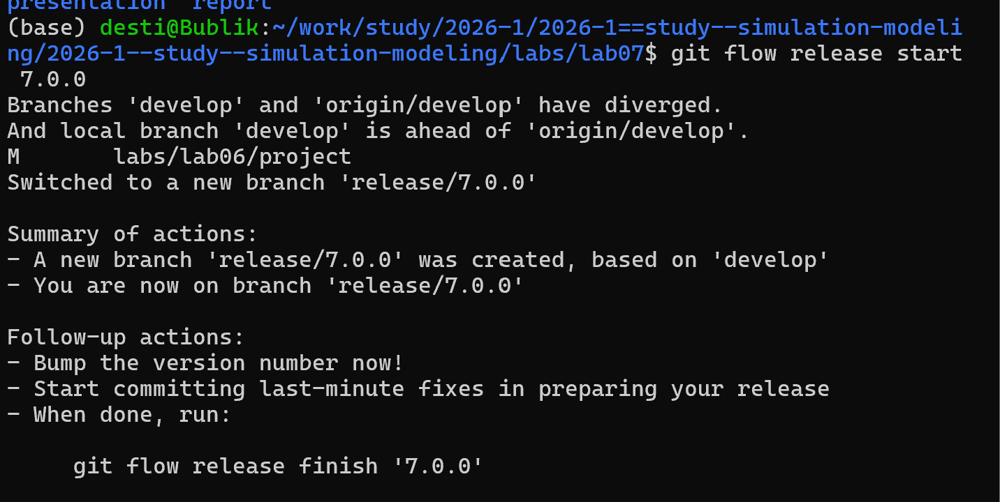
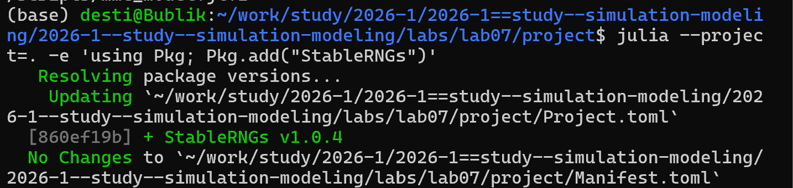
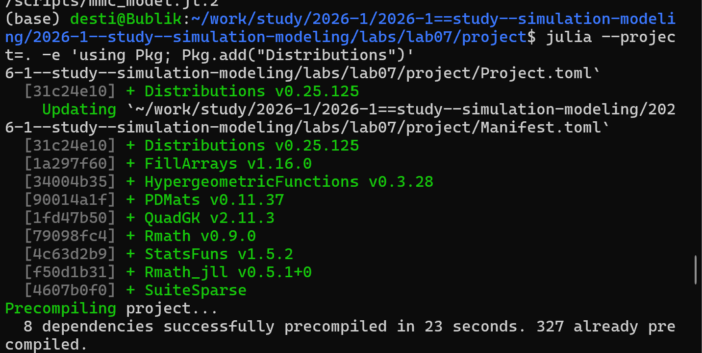
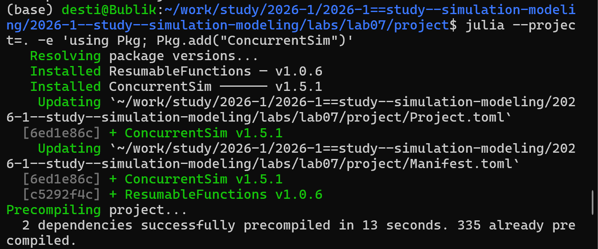
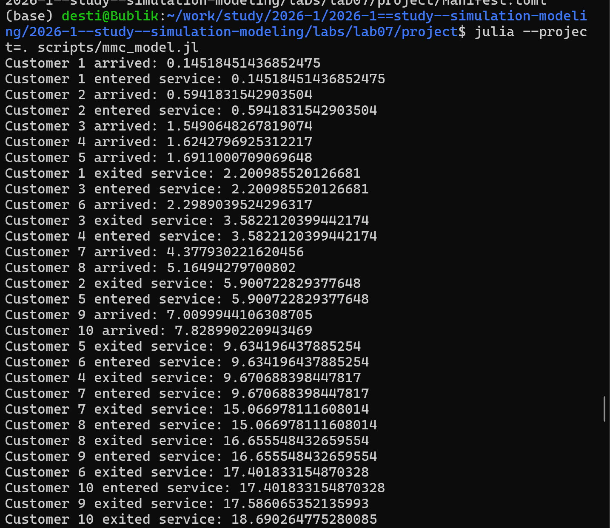
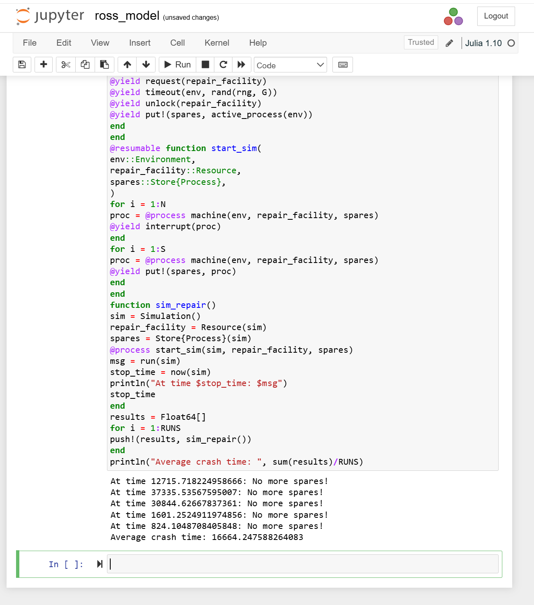
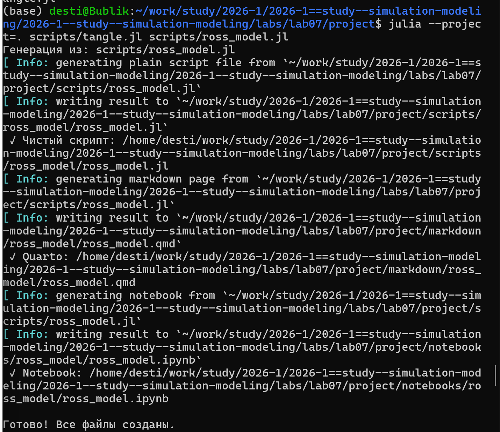
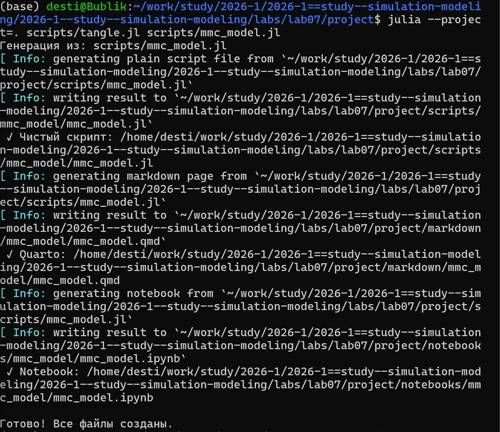
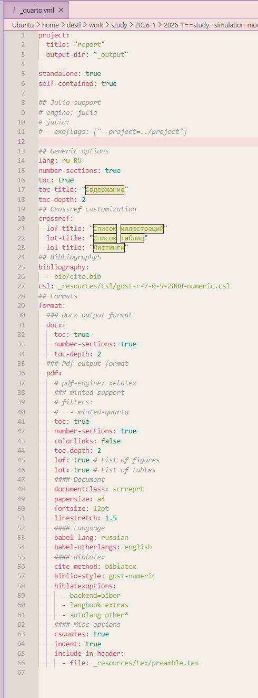

---
## Author
author:
  name: Тарасова Алина Андреевна
  degrees: DSc
  orcid: 0000-0002-0877-7063
  email: 1132236013@rudn.ru
  affiliation:
    - name: Российский университет дружбы народов
      country: Российская Федерация
      postal-code: 117198
      city: Москва
      address: ул. Миклухо-Маклая, д. 6
## Title
title: Дискретно-событийное моделирование
subtitle: Лабораторная работа №7
license: CC BY
date: today
date-format: "2026-05-10"
---

# Информация

## Докладчик

:::::::::::::: {.columns align=center}
::: {.column width="70%"}

  * Тарасова Алина Андреевна
  * студентка
  * Российский университет дружбы народов им. П. Лумумбы
  * [1132236013@rudn.ru](mailto:1132236013@rudn.ru)

:::
::: {.column width="30%"}

:::
::::::::::::::

# Вводная часть

## Актуальность

- Дискретно-событийное моделирование широко применяется для анализа систем массового обслуживания
- Модели M/M/c и Росса позволяют оценивать производительность и надёжность реальных систем
- Важно уметь реализовывать такие модели программно и интерпретировать результаты

## Объект и предмет исследования

- **Объект:** системы массового обслуживания
- **Предмет:** дискретно-событийное моделирование моделей M/M/c и Росса на языке Julia

## Цели и задачи

- Освоить метод дискретно-событийного моделирования
- Реализовать модели M/M/c и Росса на Julia
- Провести параметрические исследования
- Построить графики и сравнить с аналитикой

## Материалы и методы

- Язык программирования Julia
- Пакеты: `ConcurrentSim`, `ResumableFunctions`, `Distributions`, `Plots`, `Literate`, `DrWatson`
- Quarto для генерации отчётов и презентаций

# Создание презентации

## Процессор `quarto`

- Quarto: универсальный издательский инструмент
- Поддержка Julia, Python, R
- Создание PDF, HTML, DOCX

## Формат `pdf`

- Использование LaTeX
- Пакет для презентации: beamer
- Автоматическая компиляция через `quarto render`

## Код для формата `pdf`

```yaml
format:
  beamer:
    theme: metropolis
    aspectratio: 169
    slide-level: 2
```

## Формат `html`

- Используется фреймворк reveal.js
- Интерактивная презентация
- Поддержка анимации и переходов

## Код для формата `html`

```yaml
format:
  revealjs:
    theme: beige
    slide-number: true
```

# Выполнение лабораторной работы

## 1. Создание нового релиза

- Создан релиз v.7.0.0 для лабораторной работы №7

{#fig-release width=70%}

## 2. Настройка окружения Julia

- Запуск Julia и установка пакетов

{#fig-julia-start width=70%}

{#fig-packages width=70%}

## 3. Установка пакетов для скриптов

{#fig-install1 width=70%}

{#fig-install2 width=70%}

{#fig-install3 width=70%}

{#fig-install4 width=70%}

## 4. Запуск модели M/M/c

- Запуск скрипта `scripts/mmc_model.jl`

{#fig-mmc-run width=70%}

- Создан Jupyter Notebook для модели M/M/c

{#fig-mmc-notebook width=70%}

## 5. Запуск модели Росса

- Запуск скрипта `scripts/ross_model.jl`

{#fig-ross-run width=70%}

- Создан Jupyter Notebook для модели Росса

{#fig-ross-notebook width=70%}

## 6. Создание производных форматов

- Генерация чистого кода, Notebook и Quarto-документов

{#fig-tangle1 width=70%}

{#fig-tangle2 width=70%}

## 7. Настройка отчёта

- В `_quarto.yml` добавлена поддержка Julia

{#fig-quarto-config width=70%}

## 8. Подключение документации

- В отчёт подключены сгенерированные `.qmd` файлы

{#fig-include width=70%}

```julia


```

# Результаты

## Реализованные модели

- Реализованы обе модели на Julia с использованием `ConcurrentSim`
- Код оформлен в литературном стиле
- Сгенерированы чистые скрипты, Notebook и Quarto-документы

## Параметрические исследования

- **M/M/c:** исследовано влияние числа каналов на длину очереди и время ожидания
- **Модель Росса:** исследовано влияние числа ремонтников и резервных машин на среднее время до падения системы

## Построенные графики

- Динамика числа заявок в системе
- Загрузка ремонтника
- Изменение числа исправных машин во времени

## Итоговый отчёт

- Отчёт скомпилирован в PDF
- Все результаты интегрированы в единый документ

# Итоговый слайд

## Основной вывод

- Дискретно-событийное моделирование — эффективный инструмент анализа СМО
- Библиотека `ConcurrentSim` в Julia позволяет гибко реализовывать модели любой сложности
- Литературное программирование обеспечивает воспроизводимость и прозрачность исследований

# Рекомендую

## Принцип 10/20/30

- 10 слайдов
- 20 минут на доклад
- 30 кегль шрифта

## Связь слайдов

::: incremental

- Один слайд — одна мысль
- Нельзя ссылаться на объекты с предыдущих слайдов
- Каждый слайд должен иметь заголовок

:::

## Количество сущностей

::: incremental

- Человек может одновременно помнить $7 \pm 2$ элемента
- На слайде — не более 5 элементов
- Можно группировать элементы до 5 групп

:::

## Общие рекомендации

::: incremental

- Слайды дополняют выступление, а не дублируют его
- Информация изложена кратко и структурированно
- Слайд не перегружен графикой и текстом
- Минимум анимации и переходов

:::

## Представление данных

::: incremental

- Лучше — в виде схемы
- Менее оптимально — рисунок, график, таблица
- Текст — только если другие способы не подошли

:::

# Список литературы{.unnumbered}

::: {#refs}
:::

- Имитационное моделирование. Практикум. https://esystem.rudn.ru/pluginfile.php/3094278/modeling-lab.pdf

