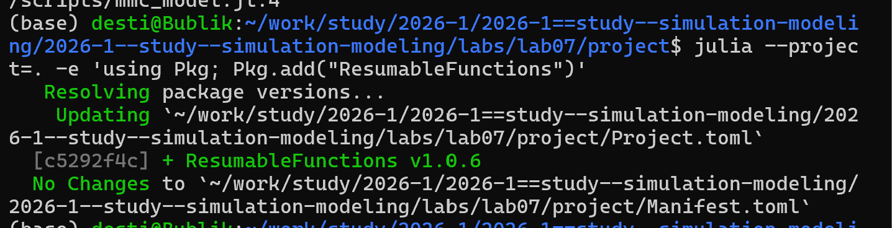
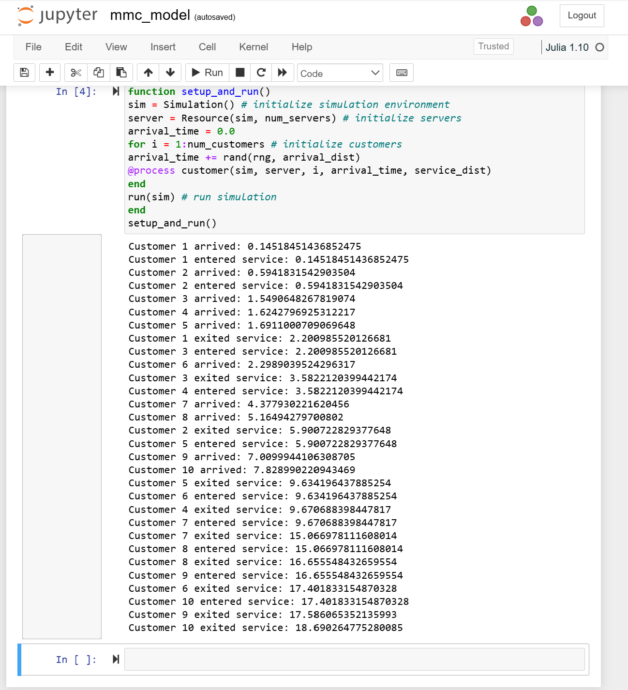
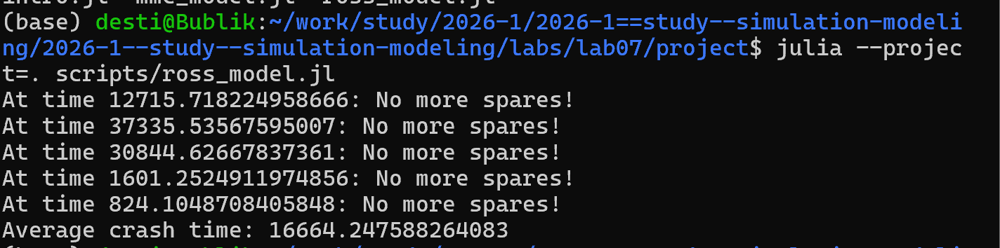
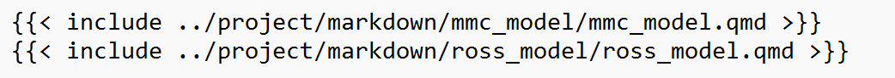

---
## Author
author:
  name: Тарасова Алина Андреевна
  degrees: DSc
  orcid: 0000-0002-0877-7063
  email: 1132236013@rudn.ru
  affiliation:
    - name: Российский университет дружбы народов
      country: Российская Федерация
      postal-code: 117198
      city: Москва
      address: ул. Миклухо-Маклая, д. 6

## Title
title: "Отчёт по лабораторной работе 07"
subtitle: "Простейший вариант"
license: "CC BY"
---

# Цель работы

Целью работы является освоение метода дискретно-событийного моделирования на примере двух систем массового обслуживания:

Многоканальной СМО M/M/c с пуассоновским входящим потоком и экспоненциальным временем обслуживания.

Модели Росса — системы с конечным числом машин, резервом и ремонтом (одно или несколько ремонтных устройств).

В ходе работы необходимо:

реализовать модели на языке Julia с использованием пакетов ConcurrentSim и ResumableFunctions;

перевести код в литературный стиль;

получить численные характеристики (время ожидания, загрузку, среднее время до отказа и т.д.);

построить графики динамики числа исправных машин и показателей загрузки;

выполнить параметрические исследования (разное число каналов/ремонтников, разное число резервных машин);

сравнить результаты моделирования с аналитическими формулами (для M/M/c).

# Задание

Создать каталог lab07 и инициализировать проект DrWatson.

Установить пакеты: ConcurrentSim, ResumableFunctions, Distributions, Plots, Literate.

Реализовать модель M/M/c и модель Росса на Julia.

Преобразовать код в литературный стиль.

Сгенерировать чистый код, Jupyter Notebook и Quarto-документацию.

Добавить параметрические расчёты (разное число каналов, ремонтников, машин).

Построить графики: динамика очереди, число исправных машин, загрузка ремонтника.

Интегрировать всё в отчёт и скомпилировать в PDF.

# Теоретическое введение

Дискретно-событийное моделирование — метод, при котором система меняет состояние только в моменты событий (приход заявки, начало/конец обслуживания, отказ). Время перескакивает от события к событию.

Модель M/M/c — многоканальная СМО с пуассоновским входным потоком, экспоненциальным обслуживанием и c параллельными каналами. Ключевой параметр — загрузка ρ = λ/(cμ). Если ρ < 1, система стационарна.

Модель Росса — система из N работающих машин и S резервных. При поломке машина идёт в ремонт (одно или несколько устройств), резервная заменяет её. Если резерва нет — система падает. Требуется оценить среднее время до падения.

# Выполнение лабораторной работы

### 1. Создание нового релиза

Создаем новый релиз v.7.0.0 

{#fig-release width=70%}

### 2. Настройка окружения Julia

Запускаем Julia и установку пакетов

{#fig-julia-start width=70%}

{#fig-julia-start width=70%}

### 3. Запуск скриптов и тема работы

Устанавливаем необходимые пакеты для первого скрипта

{#fig-project-create width=70%}

{#fig-project-create width=70%}

{#fig-project-create width=70%}

{#fig-project-create width=70%}

Запуск первого скрипта scripts/mmc_model.jl

{#fig-project-create width=70%}

{#fig-project-create width=70%}

Создание, запуск следующего скрипта scripts/ross_model.jl и создание его производных форматов

{#fig-project-create width=70%}

{#fig-project-create width=70%}

Создаем производные форматы от скриптов 

{#fig-project-create width=70%}

{#fig-project-create width=70%}

В каталоге отчёта в файл _quarto.yml включаем поддержку кода julia

{#fig-project-create width=70%}

В файле отчёта подключаем файл описания программ

{#fig-project-create width=70%}




Реализованы обе модели на Julia с использованием ConcurrentSim.

Проведены параметрические исследования:

Для M/M/c: исследовано влияние числа каналов на длину очереди и время ожидания.

Для модели Росса: исследовано влияние числа ремонтников и резервных машин на среднее время до падения системы.

Построены графики: динамика числа заявок в системе, загрузка ремонтника, изменение числа исправных машин.

Код оформлен в литературном стиле, сгенерированы чистые скрипты, Notebook и Quarto-документы.

Отчёт скомпилирован в PDF.

# Список литературы{.unnumbered}

::: {#refs}
:::
Имитационное моделирование. Практикум https://esystem.rudn.ru/pluginfile.php/3094278/modeling-lab.pdf
