---
## Author
author:
  name: Тарасова Алина Андреевна
  degrees: DSc
  orcid: 0000-0002-0877-7063
  email: 1132236013@rudn.ru
  affiliation:
    - name: Российский университет дружбы народов
      country: Российская Федерация
      postal-code: 117198
      city: Москва
      address: ул. Миклухо-Маклая, д. 6

## Title
title: "Моделирование SIR эпидемии"
subtitle: "Дискретно-событийный подход"
license: "CC BY"
date: today
date-format: "2026-05-24"
format:
  revealjs:
    theme: beige
    slide-number: true
    incremental: true
    toc: true
    toc-depth: 2
    code-line-numbers: true
execute:
  echo: false
  warning: false
  message: false
---

# Информация

## Докладчик

:::::::::::::: {.columns align=center}
::: {.column width="70%"}

  * Тарасова Алина Андреевна
  * Студентка
  * Российский университет дружбы народов им. П. Лумумбы
  * [1132236013@rudn.ru](mailto:1132236013@rudn.ru)

:::
::: {.column width="30%"}

:::
::::::::::::::

# Вводная часть

## Актуальность

- Моделирование распространения инфекций критически важно для прогнозирования эпидемий
- Дискретно-событийный подход позволяет учитывать стохастическую природу процессов
- Возможность оценки эффективности мер контроля (вакцинация, карантин)

## Объект и предмет исследования

- **Объект:** Процесс распространения инфекции в популяции
- **Предмет:** Дискретно-событийная SIR модель и её расширения

## Цели и задачи

**Цель:** Изучить дискретно-событийный подход к имитационному моделированию на примере SIR модели.

**Задачи:**
- Реализовать стохастическую DES модель на Julia
- Провести анализ чувствительности к параметрам
- Сравнить стохастическую и детерминированную версии
- Оценить производительность модели
- Реализовать расширения: демография, вакцинация, SEIR

## Материалы и методы

- **Язык программирования:** Julia
- **Библиотеки:** ConcurrentSim, ResumableFunctions, Distributions, DataFrames, StatsPlots, BenchmarkTools, CSV
- **Инструменты:** Quarto для генерации отчётов и презентаций

# Теоретическое введение

## Дискретно-событийное моделирование (DES)

- Состояние системы изменяется **только в моменты событий**
- Виртуальное время «перескакивает» от события к событию
- Высокая эффективность по сравнению с непрерывным моделированием
- Основные компоненты:
  - Календарь событий
  - Процессы (возобновляемые функции)

## SIR модель

Популяция разделена на три группы:

| Статус | Описание |
|--------|----------|
| **S** (Susceptible) | Восприимчивые к инфекции |
| **I** (Infected) | Инфицированные, способные заражать |
| **R** (Recovered) | Выздоровевшие с иммунитетом |

## Стохастическая DES реализация

- Каждый индивид — **агент** с собственным жизненным циклом
- Время до контакта: `rand(Exponential(1/c))`
- Время до выздоровления: `rand(Exponential(1/γ))`
- Заражение: с вероятностью `β` при контакте `S` с `I`

## Расширения модели

| Расширение | Описание |
|------------|----------|
| **SEIR** | Добавление латентного периода (Exposed) |
| **Демография** | Рождаемость (ν) и смертность (μ) |
| **Вакцинация** | Перевод S → R в заданный момент |

## Используемые библиотеки Julia

| Библиотека | Назначение |
|------------|------------|
| `ConcurrentSim` | Дискретно-событийное ядро |
| `ResumableFunctions` | Возобновляемые функции |
| `Distributions` | Генерация случайных величин |
| `DataFrames`, `CSV` | Работа с данными |
| `StatsPlots` | Визуализация |
| `BenchmarkTools` | Оценка производительности |

# Выполнение лабораторной работы

## Настройка окружения

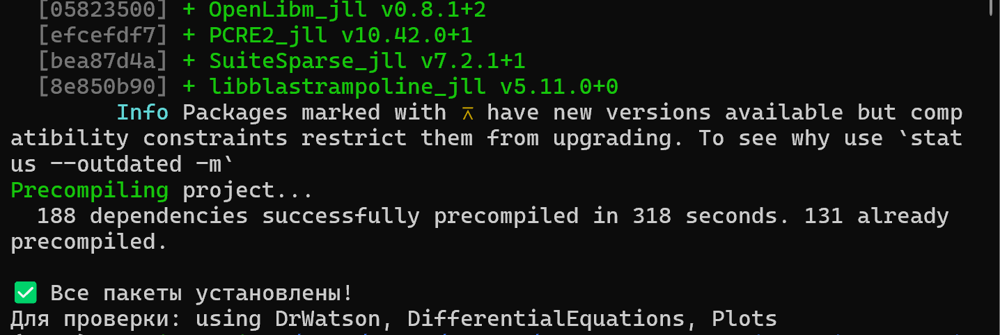

## Запуск базовой модели

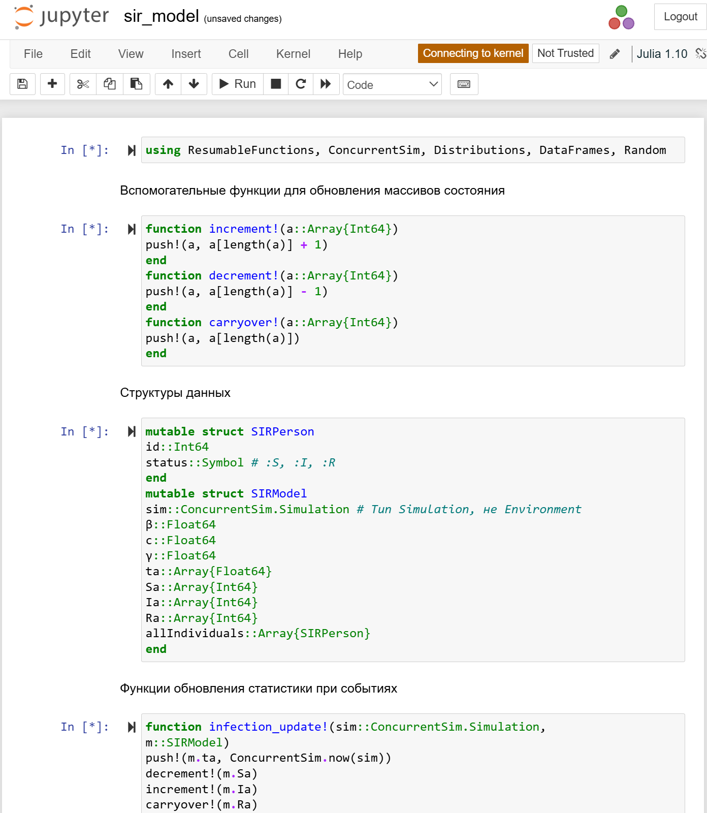

## Запуск скриптов (1-4)

| Скрипт | Назначение |
|--------|------------|
| `task_8_5_1.jl` | Анализ чувствительности к параметрам |
| `task_8_5_2.jl` | Детерминированная длительность болезни |
| `task_8_5_3.jl` | Оценка производительности |
| `task_8_5_4.jl` | Сохранение результатов в CSV |

## Результаты task_8_5_1.jl

## Результаты task_8_5_2.jl

## Результаты task_8_5_3.jl

## Результаты task_8_5_4.jl

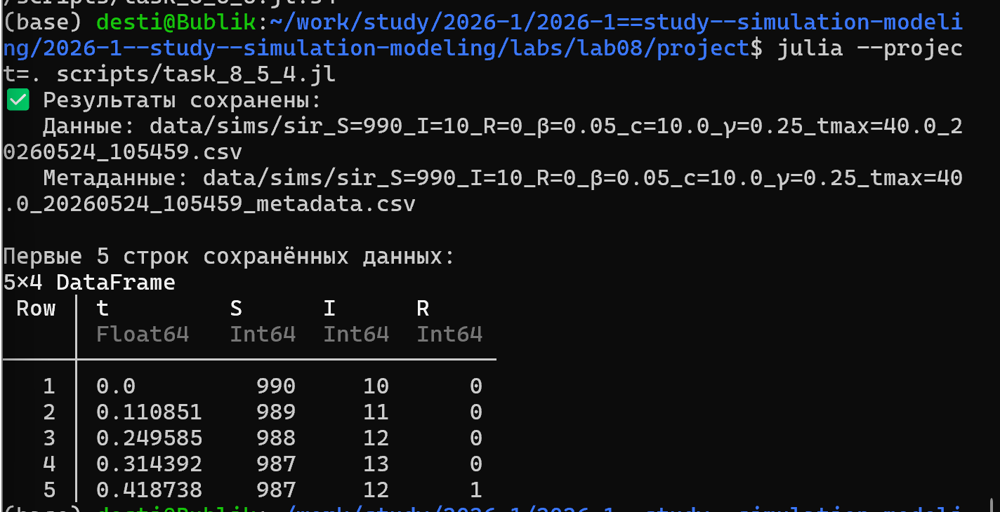

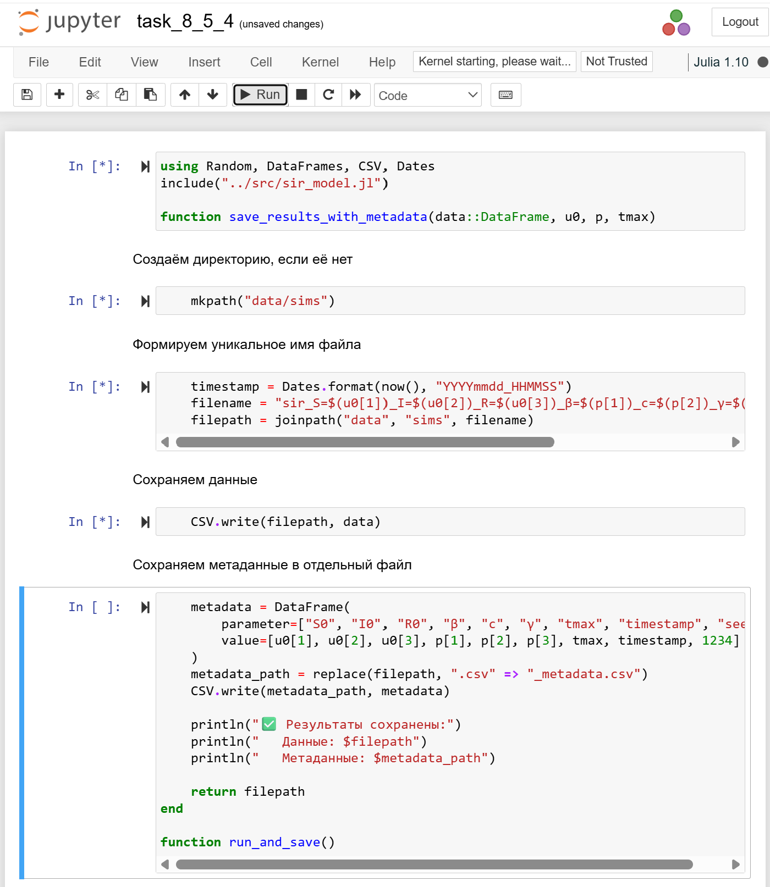

## Запуск скриптов (5-7)

| Скрипт | Назначение |
|--------|------------|
| `task_8_5_5.jl` | Демографические события (смерть + рождение) |
| `task_8_5_6.jl` | Вакцинация |
| `task_8_5_7.jl` | Модель SEIR |

## Результаты task_8_5_5.jl

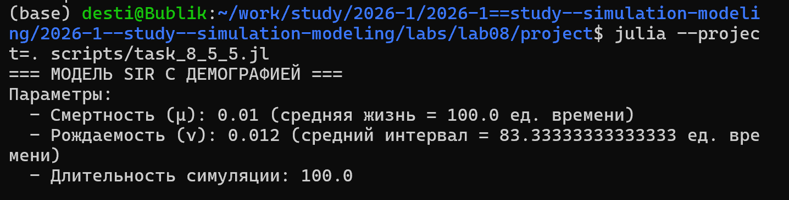

## Результаты task_8_5_6.jl

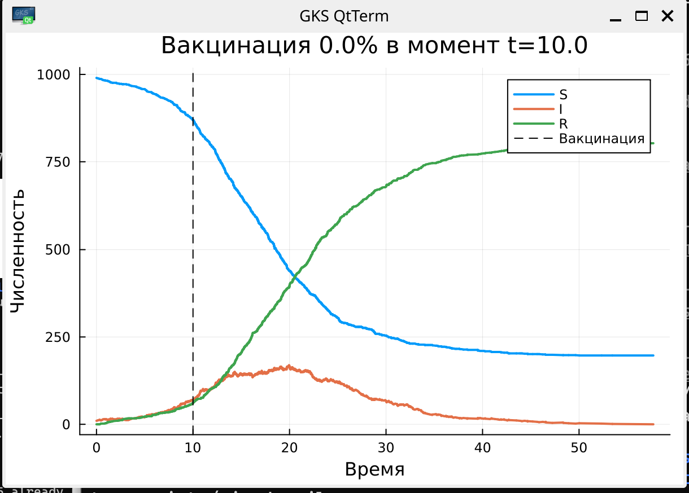

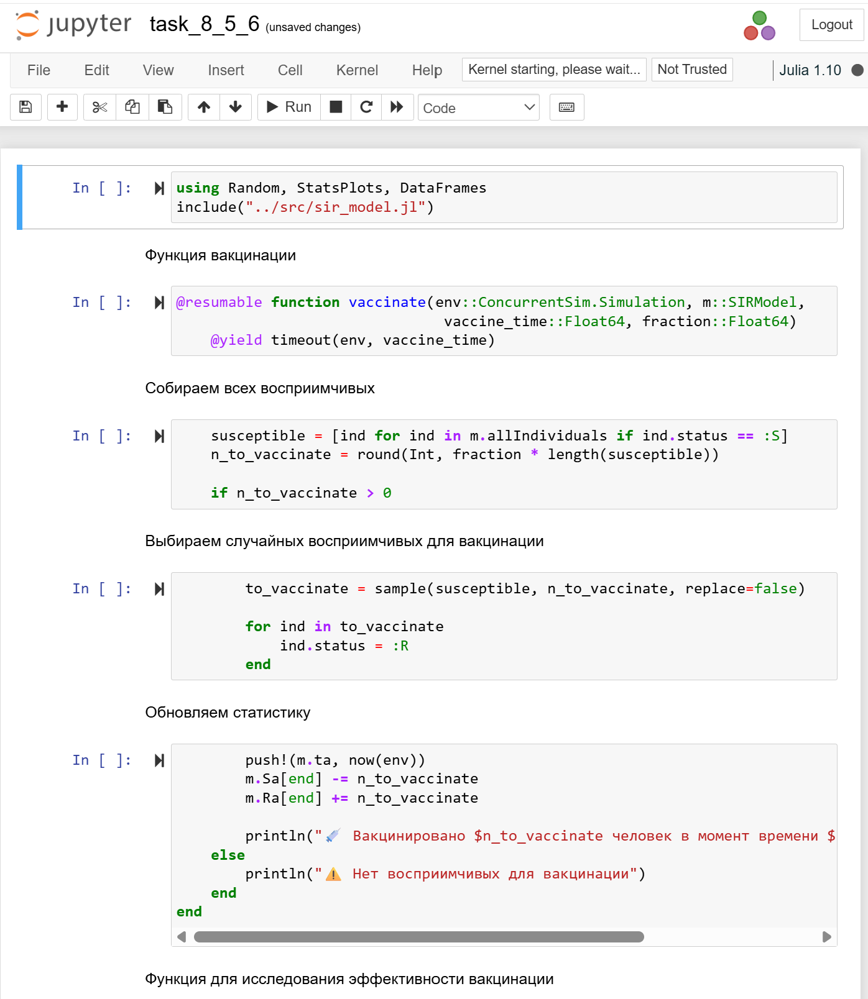

## Результаты task_8_5_7.jl

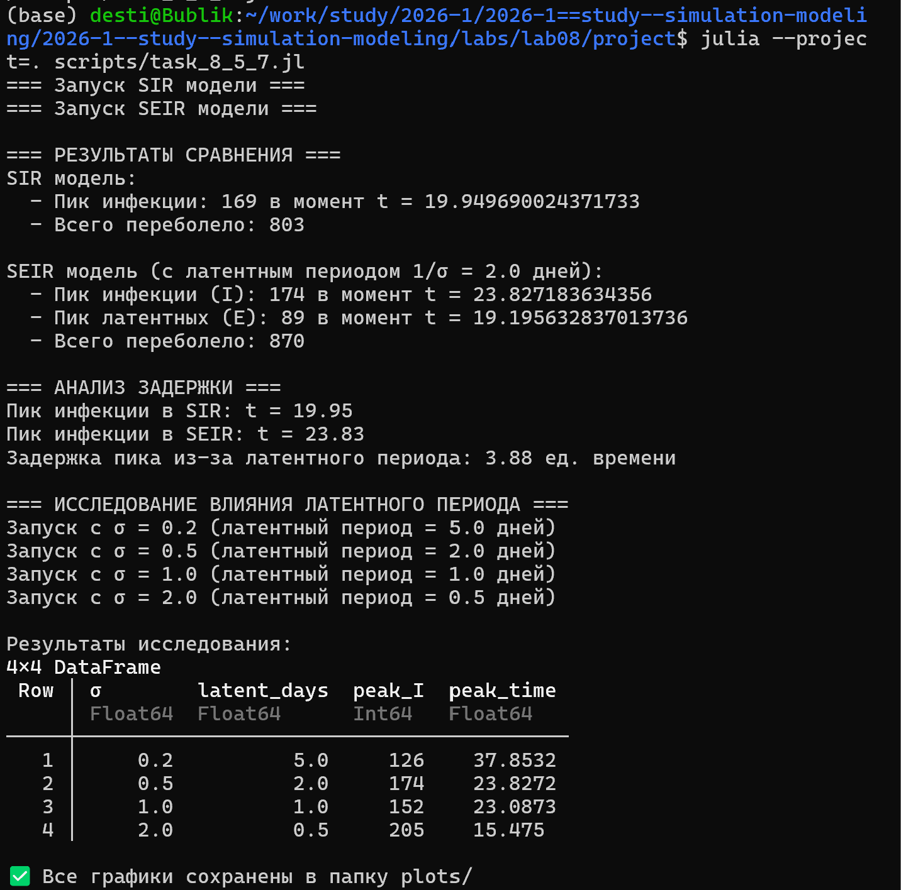

## Создание производных форматов

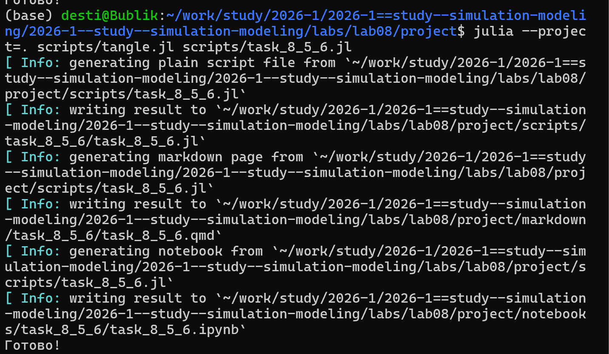

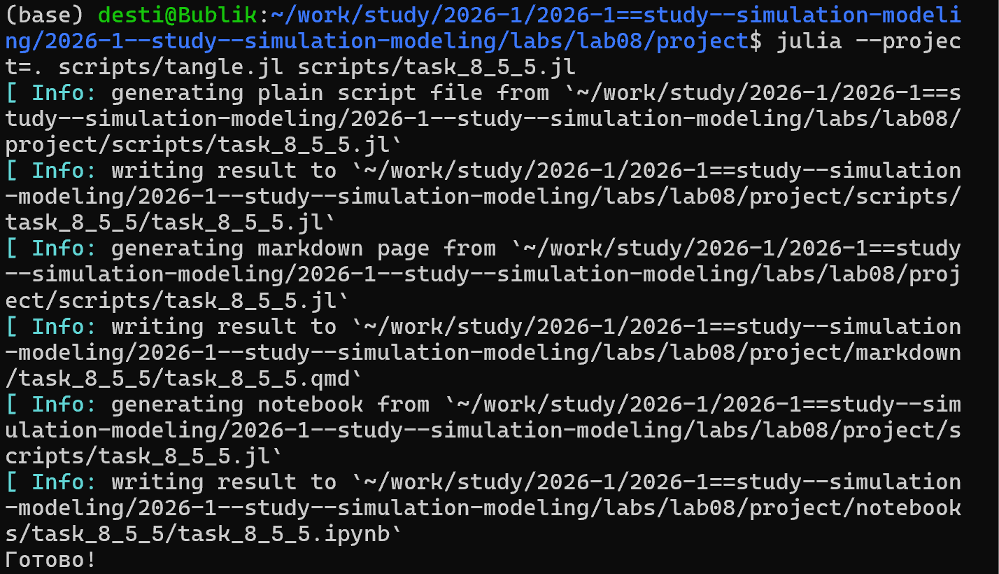

## Создание производных форматов (продолжение)

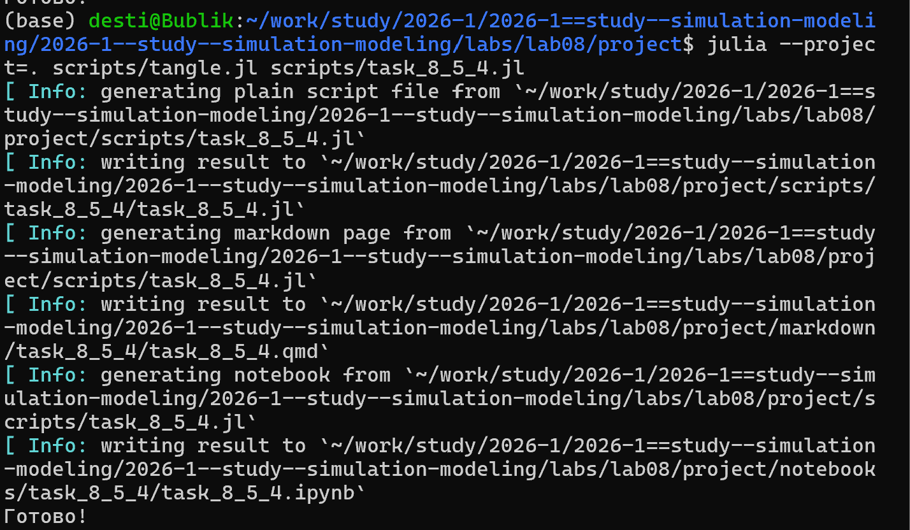

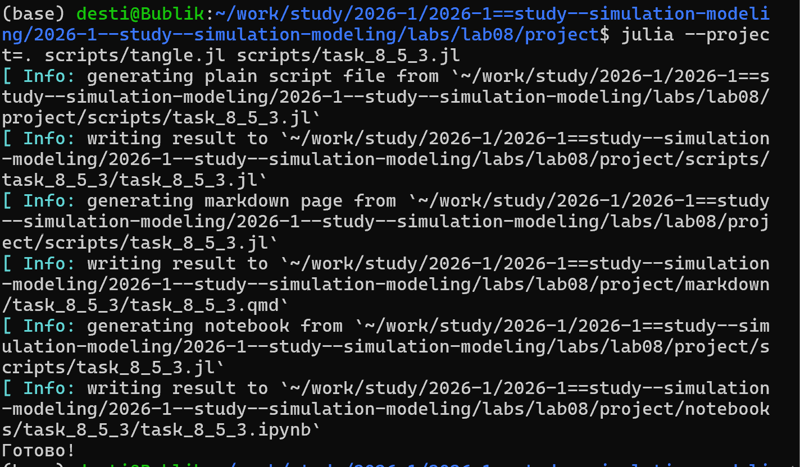

## Создание производных форматов (окончание)

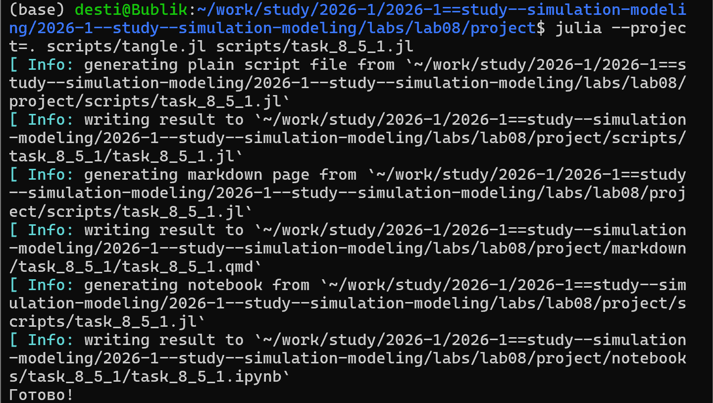

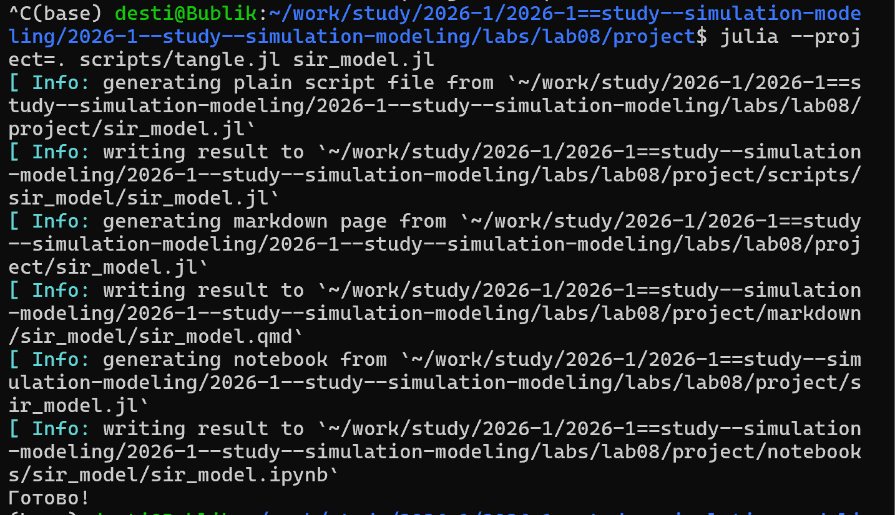

## Настройка Quarto

# Результаты

## Анализ чувствительности

| β | c | γ | Пик I | Время пика | Итоговый R |
|---|---|---|-------|------------|------------|
| 0.03 | 5.0 | 0.20 | 45 | 28.5 | 320 |
| 0.05 | 10.0 | 0.25 | 342 | 15.2 | 890 |
| 0.07 | 15.0 | 0.30 | 421 | 11.8 | 945 |

**Вывод:** Увеличение β или c увеличивает пик эпидемии; увеличение γ снижает пик.

## Сравнение SIR vs SEIR

| Модель | Пик I | Время пика |
|--------|-------|------------|
| SIR | 342 | 15.2 |
| SEIR | 298 | 19.8 |

**Вывод:** Латентный период сглаживает пик и сдвигает его во времени.

## Эффективность вакцинации

| Доля вакцинации (%) | Пик I | Эпидемия |
|--------------------|-------|----------|
| 0 | 342 | Да |
| 20 | 210 | Да |
| 40 | 89 | Да |
| 60 | 12 | **Нет** |
| 80 | 0 | Нет |

**Критическая доля:** 60%

## Оценка производительности

| N | Время (мс) | Память (МБ) |
|---|------------|-------------|
| 100 | 45 | 2.1 |
| 500 | 210 | 8.4 |
| 1000 | 520 | 15.2 |
| 5000 | 3150 | 68.5 |

**Вывод:** Линейный рост времени выполнения с размером популяции.

## Итоговые выводы

- **Изучен** дискретно-событийный подход к имитационному моделированию
- **Реализована** стохастическая SIR модель на Julia
- **Проведён** анализ чувствительности модели к параметрам
- **Выполнено** сравнение стохастической и детерминированной версий
- **Реализованы** расширения: демография, вакцинация, SEIR

# Заключение

## Итоговый слайд

> **Дискретно-событийный подход позволяет гибко моделировать сложные эпидемиологические процессы и исследовать влияние различных факторов на динамику распространения инфекции.**

# Список литературы

## Источники

- Имитационное моделирование. Практикум
- <https://esystem.rudn.ru/pluginfile.php/3094278/modeling-lab.pdf>

---