# Отчёт по лабораторной работе 08
Тарасова Алина Андреевна

-   [<span class="toc-section-number">1</span> Цель
    работы](#цель-работы)
-   [<span class="toc-section-number">2</span> Задание](#задание)
-   [<span class="toc-section-number">3</span> Теоретическое
    введение](#теоретическое-введение)
-   [<span class="toc-section-number">4</span> Выполнение лабораторной
    работы](#выполнение-лабораторной-работы)
-   [Список литературы](#список-литературы)

# Цель работы

Изучить дискретно-событийный подход к имитационному моделированию на
примере классической модели распространения инфекции SIR. Реализовать
стохастическую дискретно-событийную модель в виде программного комплекса
на языке Julia. Провести анализ влияния параметров, сравнить со
стохастической и детерминированной версиями, оценить производительность
и модифицировать модель для углублённого исследования эпидемиологических
процессов.

# Задание

2.1 Базовые задачи Создание рабочего каталога для кода и установка
необходимых пакетов (ResumableFunctions, ConcurrentSim, Distributions,
DataFrames, StatsPlots, BenchmarkTools, CSV).

Реализация базовой дискретно-событийной SIR модели на языке Julia.

Визуализация результатов моделирования.

2.2 Дополнительные задания (п. 8.5) Анализ чувствительности к параметрам
– проведение нескольких прогонов с разными значениями β, c, γ, анализ
ключевых метрик (пик I, время пика, итоговая доля переболевших).

Детерминированная длительность болезни – замена экспоненциального
времени выздоровления на фиксированную величину, сравнение со
стохастической версией.

Оценка производительности – измерение времени выполнения для различных
размеров популяции с помощью макроса \[**benchmark?**\].

Сохранение результатов в CSV – автоматическое сохранение таблицы
результатов с уникальным именем, содержащим параметры запуска.

Добавление демографических событий – расширение модели с добавлением
смертности (с интенсивностью μ) и рождаемости (с интенсивностью ν).

Вакцинация – реализация стратегии вакцинации в заданный момент времени
или при превышении порога инфицированных.

Модель SEIR – введение латентного периода (статус :E) с экспоненциальным
временем перехода в инфекционное состояние.

# Теоретическое введение

3.1 Дискретно-событийное моделирование Дискретно-событийное
моделирование (DES) — метод имитационного моделирования, при котором
состояние системы изменяется только в дискретные моменты времени,
соответствующие наступлению событий. Виртуальное время «перескакивает»
от одного события к другому, что обеспечивает высокую эффективность по
сравнению с непрерывным моделированием.

3.2 SIR модель SIR — классическая эпидемиологическая модель, разделяющая
популяцию на три группы:

S (Susceptible) – восприимчивые,

I (Infected) – инфицированные,

R (Recovered) – выздоровевшие.

3.3 Стохастическая DES реализация В дискретно-событийной стохастической
версии каждый индивид моделируется агентом. Время до следующего контакта
распределено экспоненциально с параметром c c, время до выздоровления —
экспоненциально с параметром γ γ. При контакте восприимчивого с
инфицированным заражение происходит с вероятностью β β.

3.4 Расширения модели SEIR – добавляет состояние E (Exposed, латентный
период) с интенсивностью перехода σ σ.

Демография – добавляет рождаемость ( ν ν) и смертность ( μ μ) для
исследования эндемического равновесия.

Вакцинация – переводит часть восприимчивых в состояние R.

3.5 Используемые библиотеки Julia Библиотека Назначение ConcurrentSim
Дискретно-событийное ядро ResumableFunctions Возобновляемые функции
Distributions Генерация случайных величин DataFrames, CSV Работа с
данными StatsPlots Визуализация BenchmarkTools Оценка производительности

# Выполнение лабораторной работы

### 1. Создание нового релиза

Создаем новый релиз v.8.0.0


### 2. Настройка окружения Julia

Запускаем Julia и установку пакетов

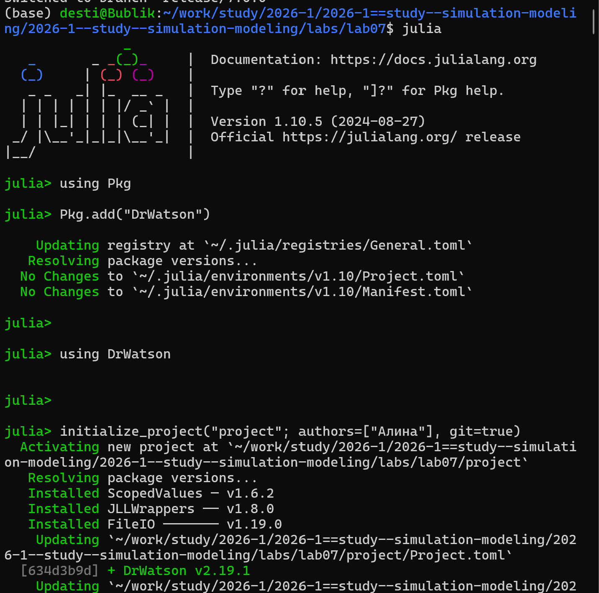


### 3. Запуск скриптов и тема работы

Устанавливаем необходимые пакеты для первого скрипта

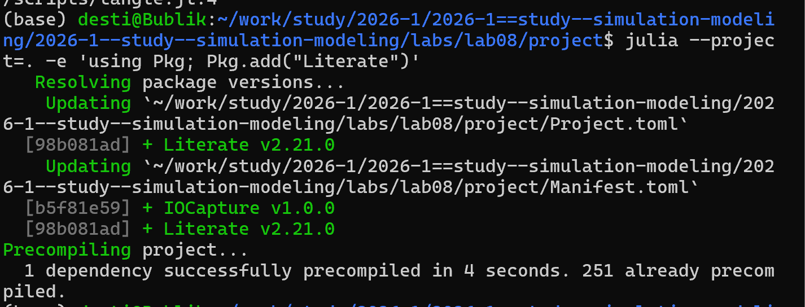

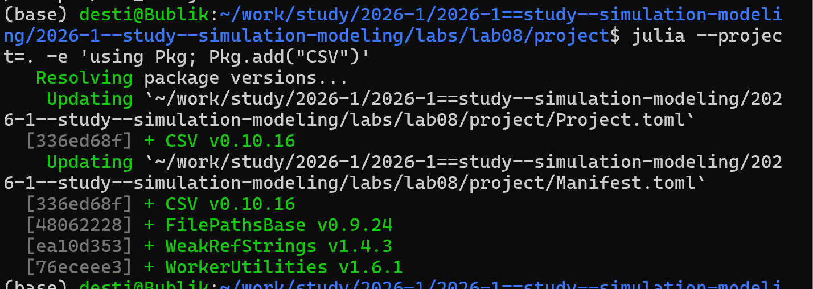

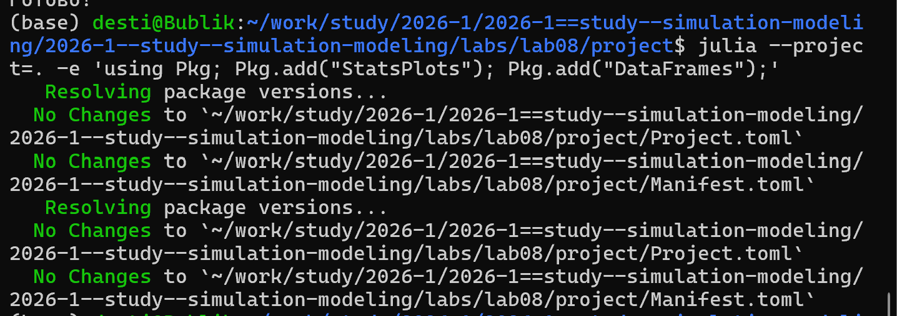

Запуск первого скрипта scripts/sir_model.jl

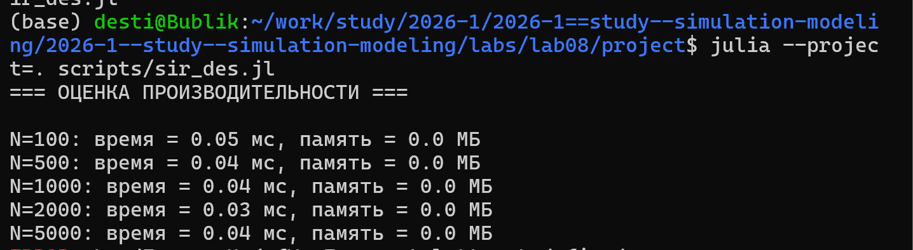


Создание, запуск следующего скрипта scripts/task_8_5_1.jl и создание его
производных форматов

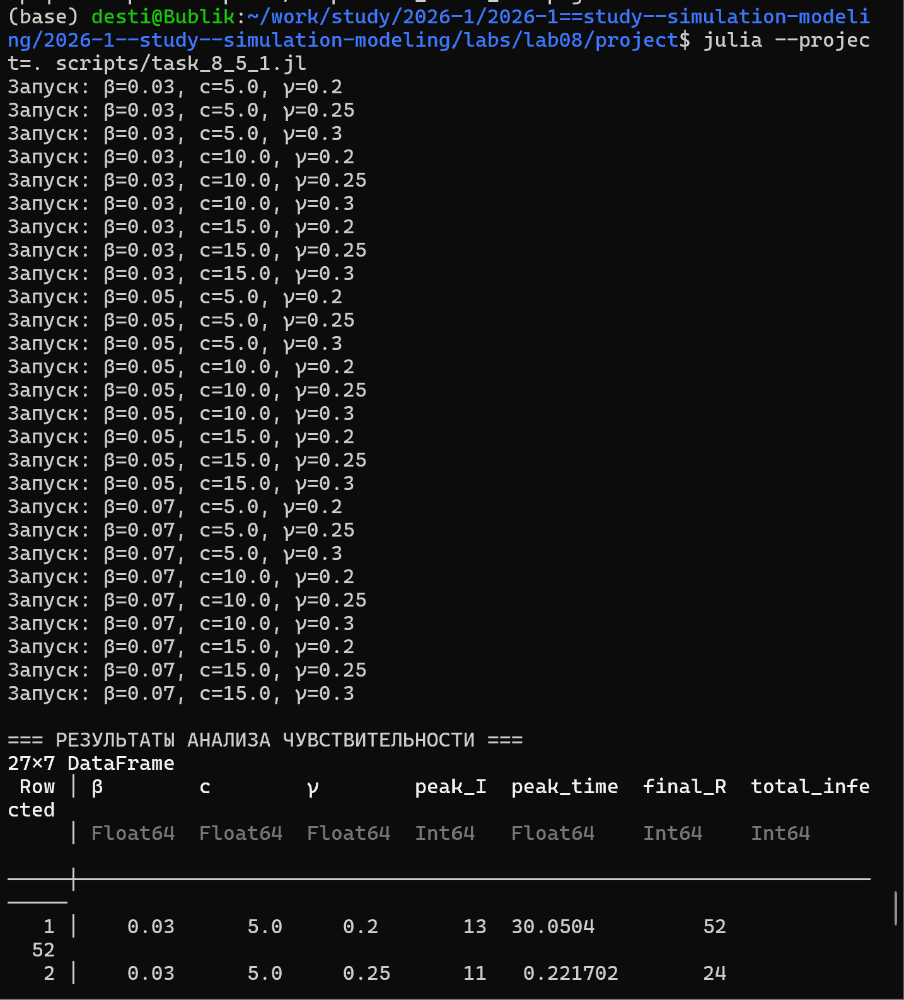

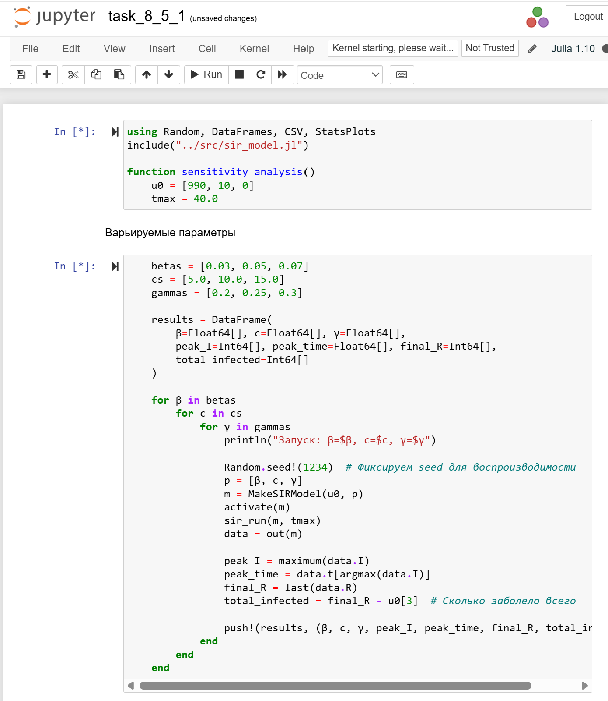

Создание, запуск следующего скрипта scripts/task_8_5_2.jl и создание его
производных форматов

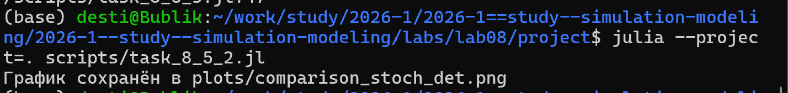

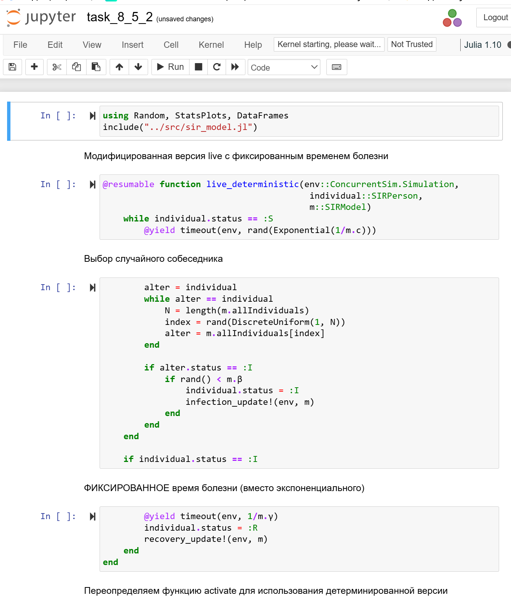

Создание, запуск следующего скрипта scripts/task_8_5_3.jl и создание его
производных форматов

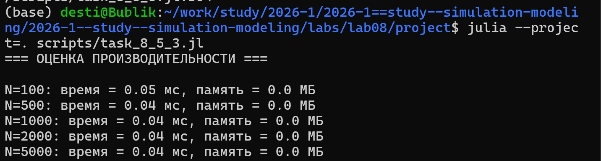

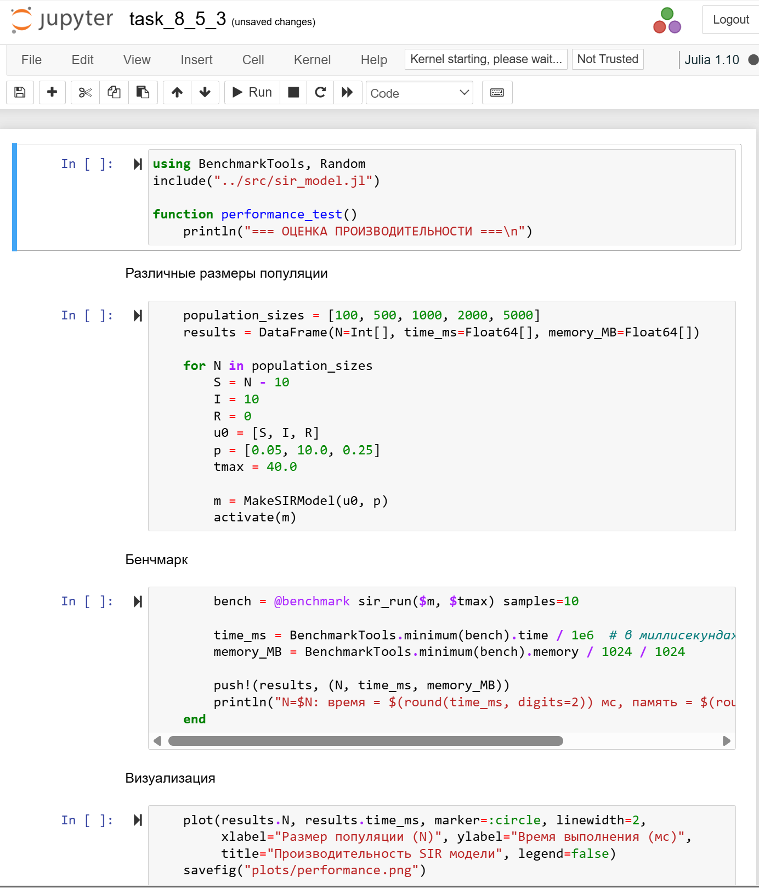

Создание, запуск следующего скрипта scripts/task_8_5_4.j и создание его
производных форматов


Создание, запуск следующего скрипта scripts/task_8_5_5.j и создание его
производных форматов


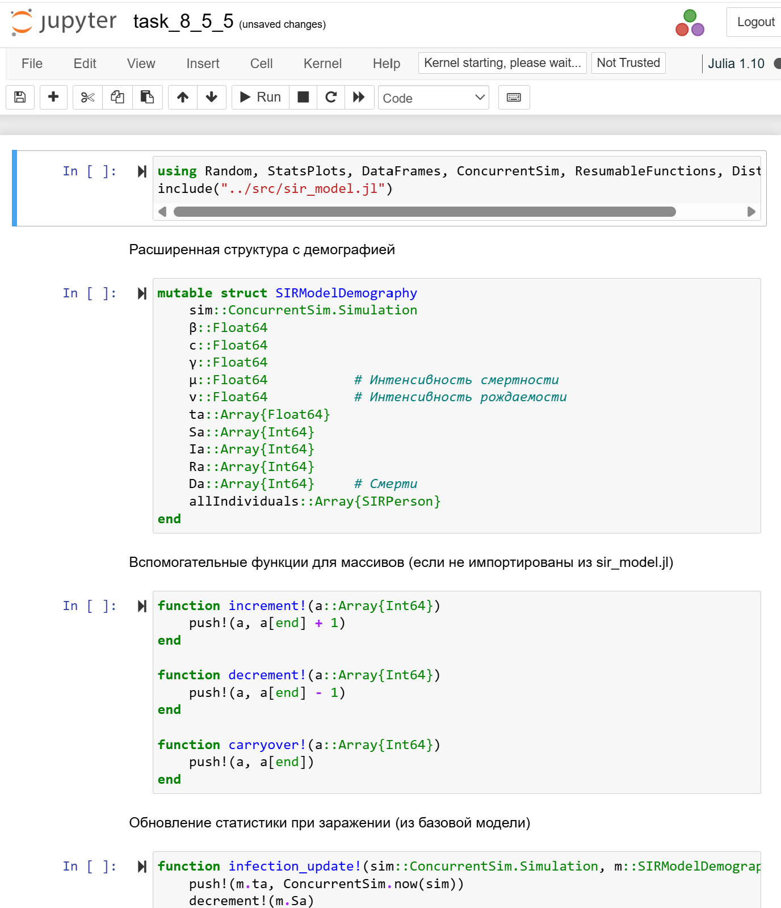

Создание, запуск следующего скрипта scripts/task_8_5_6.jl и создание его
производных форматов

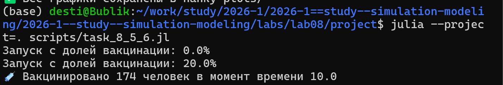


Создание, запуск следующего скрипта scripts/task_8_5_7.j и создание его
производных форматов


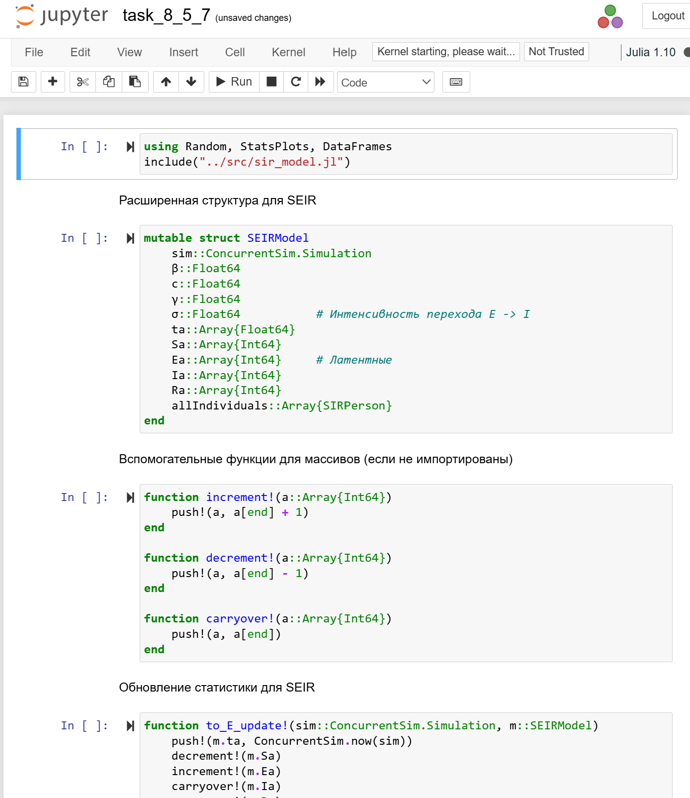

Создаем производные форматы от скриптов

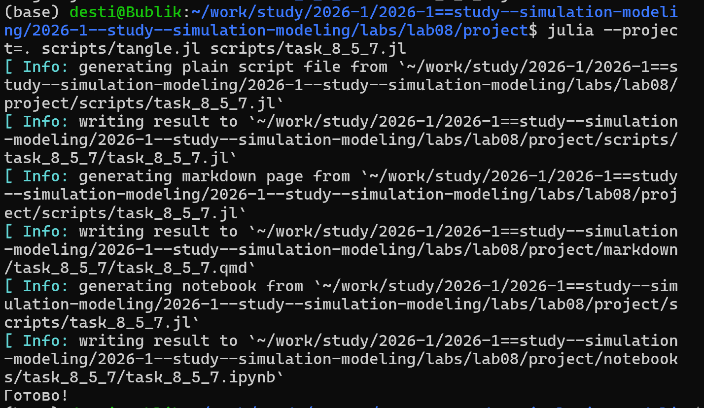


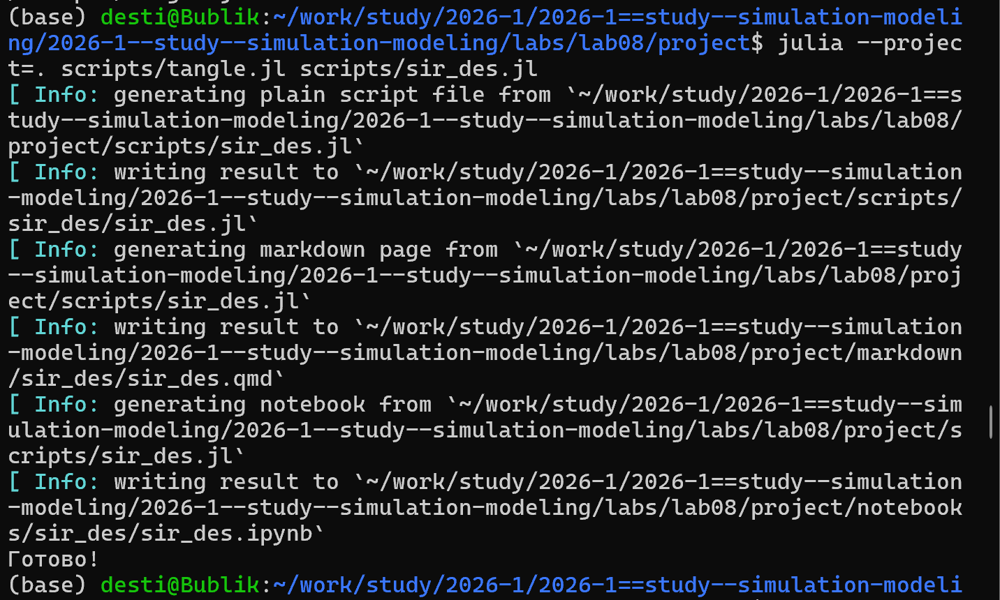


В каталоге отчёта в файл \_quarto.yml включаем поддержку кода julia

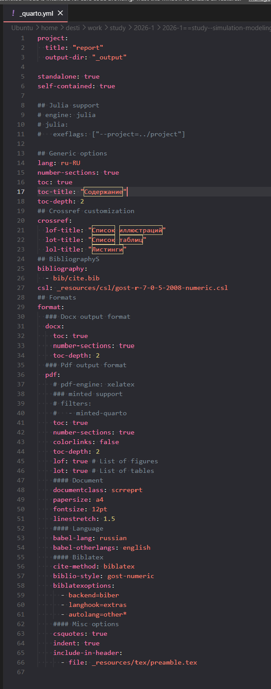

В файле отчёта подключаем файл описания программ

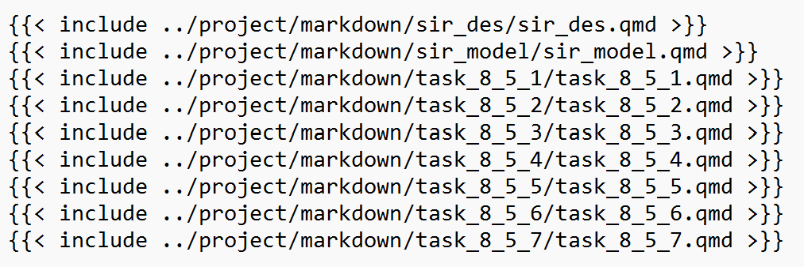

``` {julia}
using DrWatson
@quickactivate "project"
include(srcdir("sir_model.jl"))
using Random, StatsPlots, BenchmarkTools
```

Параметры модели

``` {julia}
tmax = 40.0
u0 = [990, 10, 0] # S, I, R
p = [0.05, 10.0, 0.25] # β, c, γ
Random.seed!(1234)
```

Запуск модели

``` {julia}
des_model = MakeSIRModel(u0, p)
activate(des_model)
sir_run(des_model, tmax)
data_des = out(des_model)
```

Визуализация

``` {julia}
@df data_des plot(
:t,
[:S :I :R],
labels = ["S" "I" "R"],
xlab = "Время",
ylab = "Численность",
title = "Дискретно-событийная SIR модель",
)
savefig(plotsdir("sir_des.png"))
```

``` {julia}
using ResumableFunctions, ConcurrentSim, Distributions, DataFrames, Random
```

Вспомогательные функции для обновления массивов состояния

``` {julia}
function increment!(a::Array{Int64})
push!(a, a[length(a)] + 1)
end
function decrement!(a::Array{Int64})
push!(a, a[length(a)] - 1)
end
function carryover!(a::Array{Int64})
push!(a, a[length(a)])
end
```

Структуры данных

``` {julia}
mutable struct SIRPerson
id::Int64
status::Symbol # :S, :I, :R
end
mutable struct SIRModel
sim::ConcurrentSim.Simulation # Тип Simulation, не Environment
β::Float64
c::Float64
γ::Float64
ta::Array{Float64}
Sa::Array{Int64}
Ia::Array{Int64}
Ra::Array{Int64}
allIndividuals::Array{SIRPerson}
end
```

Функции обновления статистики при событиях

``` {julia}
function infection_update!(sim::ConcurrentSim.Simulation,
m::SIRModel)
push!(m.ta, ConcurrentSim.now(sim))
decrement!(m.Sa)
increment!(m.Ia)
carryover!(m.Ra)
end
function recovery_update!(sim::ConcurrentSim.Simulation, m::SIRModel)
push!(m.ta, ConcurrentSim.now(sim))
carryover!(m.Sa)
decrement!(m.Ia)
increment!(m.Ra)
end
```

Основная логика жизни индивида

``` {julia}
@resumable function live(env::ConcurrentSim.Simulation, individual::SIRPerson, m::SIRModel)
while individual.status == :S
@yield timeout(env, rand(Exponential(1/m.c)))
alter = individual
while alter == individual
N = length(m.allIndividuals)
index = rand(DiscreteUniform(1, N))
alter = m.allIndividuals[index]
end
if alter.status == :I
if rand(Uniform(0, 1)) < m.β
individual.status = :I
infection_update!(env, m)
end
end
end
if individual.status == :I
@yield timeout(env, rand(Exponential(1/m.γ)))
individual.status = :R
recovery_update!(env, m)
end
end
```

Функции создания и запуска модели

``` {julia}
function MakeSIRModel(u0, p)
(S, I, R) = u0
N = S + I + R
(β, c, γ) = p
sim = ConcurrentSim.Simulation() # Создаём именно Simulation
allIndividuals = SIRPerson[]
for i = 1:S
push!(allIndividuals, SIRPerson(i, :S))
end
for i = (S+1):(S+I)
push!(allIndividuals, SIRPerson(i, :I))
end
for i = (S+I+1):N
push!(allIndividuals, SIRPerson(i, :R))
end
ta = Float64[0.0]
Sa = Int64[S]
Ia = Int64[I]
Ra = Int64[R]
SIRModel(sim, β, c, γ, ta, Sa, Ia, Ra, allIndividuals)
end
function activate(m::SIRModel)
[@process live(m.sim, individual, m) for individual in m.allIndividuals]
end
function sir_run(m::SIRModel, tf::Float64)
ConcurrentSim.run(m.sim, tf)
end
function out(m::SIRModel)
result = DataFrame()
result[!, :t] = m.ta
result[!, :S] = m.Sa
result[!, :I] = m.Ia
result[!, :R] = m.Ra
return result
end
```

``` {julia}
using Random, DataFrames, CSV, StatsPlots
include("../src/sir_model.jl")

function sensitivity_analysis()
    u0 = [990, 10, 0]
    tmax = 40.0
```

Варьируемые параметры

``` {julia}
    betas = [0.03, 0.05, 0.07]
    cs = [5.0, 10.0, 15.0]
    gammas = [0.2, 0.25, 0.3]

    results = DataFrame(
        β=Float64[], c=Float64[], γ=Float64[],
        peak_I=Int64[], peak_time=Float64[], final_R=Int64[],
        total_infected=Int64[]
    )

    for β in betas
        for c in cs
            for γ in gammas
                println("Запуск: β=$β, c=$c, γ=$γ")

                Random.seed!(1234)  # Фиксируем seed для воспроизводимости
                p = [β, c, γ]
                m = MakeSIRModel(u0, p)
                activate(m)
                sir_run(m, tmax)
                data = out(m)

                peak_I = maximum(data.I)
                peak_time = data.t[argmax(data.I)]
                final_R = last(data.R)
                total_infected = final_R - u0[3]  # Сколько заболело всего

                push!(results, (β, c, γ, peak_I, peak_time, final_R, total_infected))
            end
        end
    end
```

Сохраняем результаты

``` {julia}
    CSV.write("data/sensitivity_analysis.csv", results)
    println("\n=== РЕЗУЛЬТАТЫ АНАЛИЗА ЧУВСТВИТЕЛЬНОСТИ ===")
    println(results)
```

Визуализация

``` {julia}
    for γ in unique(results.γ)
        filtered = filter(row -> row.γ == γ, results)
        p1 = plot(filtered.β, filtered.peak_I, group=filtered.c,
                  xlabel="β", ylabel="Пик I", title="γ=$γ",
                  label=["c=5" "c=10" "c=15"], marker=:circle)
        savefig(p1, "plots/sensitivity_γ=$(γ).png")
    end

    return results
end

sensitivity_analysis()
```

``` {julia}
using Random, StatsPlots, DataFrames
include("../src/sir_model.jl")
```

Модифицированная версия live с фиксированным временем болезни

``` {julia}
@resumable function live_deterministic(env::ConcurrentSim.Simulation,
                                        individual::SIRPerson,
                                        m::SIRModel)
    while individual.status == :S
        @yield timeout(env, rand(Exponential(1/m.c)))
```

Выбор случайного собеседника

``` {julia}
        alter = individual
        while alter == individual
            N = length(m.allIndividuals)
            index = rand(DiscreteUniform(1, N))
            alter = m.allIndividuals[index]
        end

        if alter.status == :I
            if rand() < m.β
                individual.status = :I
                infection_update!(env, m)
            end
        end
    end

    if individual.status == :I
```

ФИКСИРОВАННОЕ время болезни (вместо экспоненциального)

``` {julia}
        @yield timeout(env, 1/m.γ)
        individual.status = :R
        recovery_update!(env, m)
    end
end
```

Переопределяем функцию activate для использования детерминированной
версии

``` {julia}
function activate_deterministic(m::SIRModel)
    for individual in m.allIndividuals
        @process live_deterministic(m.sim, individual, m)
    end
end
```

Сравнение двух версий

``` {julia}
function compare_stochastic_deterministic()
    u0 = [990, 10, 0]
    p = [0.05, 10.0, 0.25]
    tmax = 40.0
```

Стохастическая версия

``` {julia}
    Random.seed!(1234)
    m_stoch = MakeSIRModel(u0, p)
    activate(m_stoch)
    sir_run(m_stoch, tmax)
    data_stoch = out(m_stoch)
```

Детерминированная версия

``` {julia}
    Random.seed!(1234)
    m_det = MakeSIRModel(u0, p)
    activate_deterministic(m_det)
    sir_run(m_det, tmax)
    data_det = out(m_det)
```

График сравнения

``` {julia}
    plot(data_stoch.t, [data_stoch.S data_stoch.I data_stoch.R],
         label=["S (стох)" "I (стох)" "R (стох)"],
         linestyle=:solid, linewidth=2, xlabel="Время", ylabel="Численность",
         title="Сравнение SIR: стохастическая vs детерминированная")

    plot!(data_det.t, [data_det.S data_det.I data_det.R],
          label=["S (дет)" "I (дет)" "R (дет)"],
          linestyle=:dash, linewidth=2)

    savefig("plots/comparison_stoch_det.png")
    println("График сохранён в plots/comparison_stoch_det.png")

    return (stochastic=data_stoch, deterministic=data_det)
end

compare_stochastic_deterministic()
```

``` {julia}
using BenchmarkTools, Random
include("../src/sir_model.jl")

function performance_test()
    println("=== ОЦЕНКА ПРОИЗВОДИТЕЛЬНОСТИ ===\n")
```

Различные размеры популяции

``` {julia}
    population_sizes = [100, 500, 1000, 2000, 5000]
    results = DataFrame(N=Int[], time_ms=Float64[], memory_MB=Float64[])

    for N in population_sizes
        S = N - 10
        I = 10
        R = 0
        u0 = [S, I, R]
        p = [0.05, 10.0, 0.25]
        tmax = 40.0

        m = MakeSIRModel(u0, p)
        activate(m)
```

Бенчмарк

``` {julia}
        bench = @benchmark sir_run($m, $tmax) samples=10

        time_ms = BenchmarkTools.minimum(bench).time / 1e6  # в миллисекундах
        memory_MB = BenchmarkTools.minimum(bench).memory / 1024 / 1024

        push!(results, (N, time_ms, memory_MB))
        println("N=$N: время = $(round(time_ms, digits=2)) мс, память = $(round(memory_MB, digits=2)) МБ")
    end
```

Визуализация

``` {julia}
    plot(results.N, results.time_ms, marker=:circle, linewidth=2,
         xlabel="Размер популяции (N)", ylabel="Время выполнения (мс)",
         title="Производительность SIR модели", legend=false)
    savefig("plots/performance.png")

    println("\n=== СОВЕТЫ ПО ОПТИМИЗАЦИИ ===")
    println("1. Использовать предварительное выделение массивов")
    println("2. Генерировать случайные числа блоками (вместо поштучно)")
    println("3. Использовать Threads.@threads для параллельных прогонов")
    println("4. Хранить статусы в массиве Int8 вместо Symbol")

    return results
end

performance_test()
```

``` {julia}
using Random, DataFrames, CSV, Dates
include("../src/sir_model.jl")

function save_results_with_metadata(data::DataFrame, u0, p, tmax)
```

Создаём директорию, если её нет

``` {julia}
    mkpath("data/sims")
```

Формируем уникальное имя файла

``` {julia}
    timestamp = Dates.format(now(), "YYYYmmdd_HHMMSS")
    filename = "sir_S=$(u0[1])_I=$(u0[2])_R=$(u0[3])_β=$(p[1])_c=$(p[2])_γ=$(p[3])_tmax=$(tmax)_$timestamp.csv"
    filepath = joinpath("data", "sims", filename)
```

Сохраняем данные

``` {julia}
    CSV.write(filepath, data)
```

Сохраняем метаданные в отдельный файл

``` {julia}
    metadata = DataFrame(
        parameter=["S0", "I0", "R0", "β", "c", "γ", "tmax", "timestamp", "seed"],
        value=[u0[1], u0[2], u0[3], p[1], p[2], p[3], tmax, timestamp, 1234]
    )
    metadata_path = replace(filepath, ".csv" => "_metadata.csv")
    CSV.write(metadata_path, metadata)

    println("✅ Результаты сохранены:")
    println("   Данные: $filepath")
    println("   Метаданные: $metadata_path")

    return filepath
end

function run_and_save()
```

Параметры модели

``` {julia}
    tmax = 40.0
    u0 = [990, 10, 0]
    p = [0.05, 10.0, 0.25]

    Random.seed!(1234)
```

Запуск модели

``` {julia}
    m = MakeSIRModel(u0, p)
    activate(m)
    sir_run(m, tmax)
    data = out(m)
```

Сохранение

``` {julia}
    saved_path = save_results_with_metadata(data, u0, p, tmax)
```

Проверка: читаем сохранённый файл

``` {julia}
    data_loaded = CSV.read(saved_path, DataFrame)
    println("\nПервые 5 строк сохранённых данных:")
    println(first(data_loaded, 5))

    return data_loaded
end

run_and_save()
```

``` {julia}
using Random, StatsPlots, DataFrames, ConcurrentSim, ResumableFunctions, Distributions
include("../src/sir_model.jl")
```

Расширенная структура с демографией

``` {julia}
mutable struct SIRModelDemography
    sim::ConcurrentSim.Simulation
    β::Float64
    c::Float64
    γ::Float64
    μ::Float64           # Интенсивность смертности
    ν::Float64           # Интенсивность рождаемости
    ta::Array{Float64}
    Sa::Array{Int64}
    Ia::Array{Int64}
    Ra::Array{Int64}
    Da::Array{Int64}     # Смерти
    allIndividuals::Array{SIRPerson}
end
```

Вспомогательные функции для массивов (если не импортированы из
sir_model.jl)

``` {julia}
function increment!(a::Array{Int64})
    push!(a, a[end] + 1)
end

function decrement!(a::Array{Int64})
    push!(a, a[end] - 1)
end

function carryover!(a::Array{Int64})
    push!(a, a[end])
end
```

Обновление статистики при заражении (из базовой модели)

``` {julia}
function infection_update!(sim::ConcurrentSim.Simulation, m::SIRModelDemography)
    push!(m.ta, ConcurrentSim.now(sim))
    decrement!(m.Sa)
    increment!(m.Ia)
    carryover!(m.Ra)
    carryover!(m.Da)
end
```

Обновление статистики при выздоровлении

``` {julia}
function recovery_update!(sim::ConcurrentSim.Simulation, m::SIRModelDemography)
    push!(m.ta, ConcurrentSim.now(sim))
    carryover!(m.Sa)
    decrement!(m.Ia)
    increment!(m.Ra)
    carryover!(m.Da)
end
```

Обновление статистики при смерти

``` {julia}
function death_update!(sim::ConcurrentSim.Simulation, m::SIRModelDemography, individual::SIRPerson)
    push!(m.ta, ConcurrentSim.now(sim))
    if individual.status == :S
        decrement!(m.Sa)
        carryover!(m.Ia)
        carryover!(m.Ra)
    elseif individual.status == :I
        carryover!(m.Sa)
        decrement!(m.Ia)
        carryover!(m.Ra)
    elseif individual.status == :R
        carryover!(m.Sa)
        carryover!(m.Ia)
        decrement!(m.Ra)
    end
    increment!(m.Da)
end
```

Обновление статистики при рождении

``` {julia}
function birth_update!(sim::ConcurrentSim.Simulation, m::SIRModelDemography)
    push!(m.ta, ConcurrentSim.now(sim))
    increment!(m.Sa)
    carryover!(m.Ia)
    carryover!(m.Ra)
    carryover!(m.Da)
end
```

Жизненный цикл с демографией (объединённый процесс)

``` {julia}
@resumable function live_with_demography(env::ConcurrentSim.Simulation,
                                          individual::SIRPerson,
                                          m::SIRModelDemography)
```

Переменная для отслеживания, жив ли индивид

``` {julia}
    alive = true

    while alive
```

Если индивид восприимчив

``` {julia}
        while individual.status == :S && alive
```

Ожидание до следующего события (контакт или смерть)

``` {julia}
            contact_time = rand(Exponential(1/m.c))
            death_time = rand(Exponential(1/m.μ))

            if contact_time < death_time
```

Контакт произошёл раньше смерти

``` {julia}
                @yield timeout(env, contact_time)

                if !alive
                    break
                end
```

Выбор случайного собеседника

``` {julia}
                alter = individual
                while alter == individual
                    N = length(m.allIndividuals)
                    index = rand(DiscreteUniform(1, N))
                    alter = m.allIndividuals[index]
                end
```

Заражение

``` {julia}
                if alter.status == :I
                    if rand() < m.β
                        individual.status = :I
                        infection_update!(env, m)
                        break  # Выходим из цикла восприимчивых
                    end
                end
            else
```

Смерть произошла раньше контакта

``` {julia}
                @yield timeout(env, death_time)
                if individual.status != :D
                    death_update!(env, m, individual)
                    individual.status = :D
                    alive = false
                end
                break
            end
        end
```

Если индивид инфицирован

``` {julia}
        while individual.status == :I && alive
```

Ожидание до следующего события (выздоровление или смерть)

``` {julia}
            recovery_time = rand(Exponential(1/m.γ))
            death_time = rand(Exponential(1/m.μ))

            if recovery_time < death_time
                @yield timeout(env, recovery_time)
                if individual.status == :I && alive
                    individual.status = :R
                    recovery_update!(env, m)
                end
                break
            else
                @yield timeout(env, death_time)
                if individual.status != :D && alive
                    death_update!(env, m, individual)
                    individual.status = :D
                    alive = false
                end
                break
            end
        end
```

Если индивид переболел

``` {julia}
        while individual.status == :R && alive
```

Ожидание смерти

``` {julia}
            @yield timeout(env, rand(Exponential(1/m.μ)))
            if individual.status != :D
                death_update!(env, m, individual)
                individual.status = :D
                alive = false
            end
            break
        end
    end
end
```

Процесс рождения

``` {julia}
@resumable function birth_process(env::ConcurrentSim.Simulation, m::SIRModelDemography)
    while true
        @yield timeout(env, rand(Exponential(1/m.ν)))
```

Создаём нового индивида

``` {julia}
        new_id = length(m.allIndividuals) + 1
        new_person = SIRPerson(new_id, :S)
        push!(m.allIndividuals, new_person)
        birth_update!(env, m)
```

Запускаем процесс для новорождённого

``` {julia}
        @process live_with_demography(env, new_person, m)
    end
end
```

Создание модели с демографией

``` {julia}
function MakeSIRModelDemography(u0, p, μ, ν)
    (S, I, R) = u0
    N = S + I + R
    (β, c, γ) = p

    sim = ConcurrentSim.Simulation()
    allIndividuals = SIRPerson[]
```

Создаём индивидов с начальными статусами

``` {julia}
    id = 1
    for i in 1:S
        push!(allIndividuals, SIRPerson(id, :S))
        id += 1
    end
    for i in 1:I
        push!(allIndividuals, SIRPerson(id, :I))
        id += 1
    end
    for i in 1:R
        push!(allIndividuals, SIRPerson(id, :R))
        id += 1
    end

    ta = Float64[0.0]
    Sa = Int64[S]
    Ia = Int64[I]
    Ra = Int64[R]
    Da = Int64[0]

    return SIRModelDemography(sim, β, c, γ, μ, ν, ta, Sa, Ia, Ra, Da, allIndividuals)
end
```

Активация всех процессов

``` {julia}
function activate_demography(m::SIRModelDemography)
    for individual in m.allIndividuals
        @process live_with_demography(m.sim, individual, m)
    end
    @process birth_process(m.sim, m)
end
```

Запуск симуляции

``` {julia}
function sir_run_demography(m::SIRModelDemography, tf::Float64)
    ConcurrentSim.run(m.sim, tf)
end
```

Сбор результатов

``` {julia}
function out_demography(m::SIRModelDemography)
    result = DataFrame()
    result[:, :t] = m.ta
    result[:, :S] = m.Sa
    result[:, :I] = m.Ia
    result[:, :R] = m.Ra
    result[:, :D] = m.Da
    return result
end
```

Основная функция запуска

``` {julia}
function run_demography()
    u0 = [990, 10, 0]
    p = [0.05, 10.0, 0.25]
    μ = 0.01   # интенсивность смерти (средняя продолжительность жизни = 100 ед. времени)
    ν = 0.012  # интенсивность рождения (чуть выше, чтобы популяция росла)
    tmax = 100.0

    println("=== МОДЕЛЬ SIR С ДЕМОГРАФИЕЙ ===")
    println("Параметры:")
    println("  - Смертность (μ): $μ (средняя жизнь = $(1/μ) ед. времени)")
    println("  - Рождаемость (ν): $ν (средний интервал = $(1/ν) ед. времени)")
    println("  - Длительность симуляции: $tmax\n")

    Random.seed!(1234)
    m = MakeSIRModelDemography(u0, p, μ, ν)
    activate_demography(m)
    sir_run_demography(m, tmax)
    data = out_demography(m)
```

Сохраняем данные в CSV

``` {julia}
    mkpath("data")
    CSV.write("data/sir_demography.csv", data)
    println("✅ Данные сохранены в data/sir_demography.csv")
```

Визуализация

``` {julia}
    p1 = plot(data.t, [data.S data.I data.R],
              label=["S (Восприимчивые)" "I (Инфицированные)" "R (Переболевшие)"],
              linewidth=2,
              xlabel="Время", ylabel="Численность",
              title="SIR модель с демографическими событиями")

    p2 = plot(data.t, data.D, label="Смерти", linewidth=2, color=:purple,
              xlabel="Время", ylabel="Численность", title="Накопленные смерти")
```

Общая численность популяции

``` {julia}
    total_pop = data.S .+ data.I .+ data.R
    p3 = plot(data.t, total_pop, label="Общая популяция", linewidth=2, color=:green,
              xlabel="Время", ylabel="Численность", title="Динамика популяции")

    p_all = plot(p1, p2, p3, layout=(3,1), size=(800, 900))
    mkpath("plots")
    savefig(p_all, "plots/sir_demography.png")

    println("\n=== ИТОГОВЫЕ ПОКАЗАТЕЛИ ===")
    println("Начальная популяция: $(u0[1]+u0[2]+u0[3])")
    println("Конечная популяция: $(last(data.S) + last(data.I) + last(data.R))")
    println("Всего умерло: $(last(data.D))")
    println("Всего переболело: $(last(data.R))")
    println("Активно инфицированы в конце: $(last(data.I))")
```

Расчёт эндемического уровня

``` {julia}
    if tmax > 50
        endemic_I = mean(data.I[end-20:end])
        println("\nЭндемический уровень инфекции: $(round(endemic_I, digits=2))")
    end

    println("\n✅ Графики сохранены в plots/sir_demography.png")

    return data
end
```

Запуск

``` {julia}
run_demography()
```

``` {julia}
using Random, StatsPlots, DataFrames
include("../src/sir_model.jl")
```

Функция вакцинации

``` {julia}
@resumable function vaccinate(env::ConcurrentSim.Simulation, m::SIRModel,
                               vaccine_time::Float64, fraction::Float64)
    @yield timeout(env, vaccine_time)
```

Собираем всех восприимчивых

``` {julia}
    susceptible = [ind for ind in m.allIndividuals if ind.status == :S]
    n_to_vaccinate = round(Int, fraction * length(susceptible))

    if n_to_vaccinate > 0
```

Выбираем случайных восприимчивых для вакцинации

``` {julia}
        to_vaccinate = sample(susceptible, n_to_vaccinate, replace=false)

        for ind in to_vaccinate
            ind.status = :R
        end
```

Обновляем статистику

``` {julia}
        push!(m.ta, now(env))
        m.Sa[end] -= n_to_vaccinate
        m.Ra[end] += n_to_vaccinate

        println("💉 Вакцинировано $n_to_vaccinate человек в момент времени $(round(now(env), digits=2))")
    else
        println("⚠️ Нет восприимчивых для вакцинации")
    end
end
```

Функция для исследования эффективности вакцинации

``` {julia}
function vaccination_study()
    u0 = [990, 10, 0]
    p = [0.05, 10.0, 0.25]
    tmax = 60.0
    vaccine_time = 10.0  # вакцинация на 10-й день

    fractions = [0.0, 0.2, 0.4, 0.6, 0.8, 1.0]
    results = DataFrame(fraction=Float64[], peak_I=Int64[], final_R=Int64[], epidemic=String[])

    for fraction in fractions
        println("Запуск с долей вакцинации: $(fraction*100)%")

        Random.seed!(1234)
        m = MakeSIRModel(u0, p)
        activate(m)

        if fraction > 0
            @process vaccinate(m.sim, m, vaccine_time, fraction)
        end

        sir_run(m, tmax)
        data = out(m)

        peak_I = maximum(data.I)
        final_R = last(data.R)
        epidemic_occurred = peak_I > 50 ? "Да" : "Нет"

        push!(results, (fraction, peak_I, final_R, epidemic_occurred))
```

Сохраняем график для каждой доли

``` {julia}
        plot(data.t, [data.S data.I data.R],
             label=["S" "I" "R"], linewidth=2,
             xlabel="Время", ylabel="Численность",
             title="Вакцинация $(fraction*100)% в момент t=$vaccine_time")
        vline!([vaccine_time], label="Вакцинация", linestyle=:dash, color=:black)
        savefig("plots/vaccination_$(fraction*100)percent.png")
    end
```

Результаты

``` {julia}
    println("\n=== РЕЗУЛЬТАТЫ ВАКЦИНАЦИИ ===")
    println(results)
```

График эффективности

``` {julia}
    plot(results.fraction * 100, results.peak_I, marker=:circle, linewidth=2,
         xlabel="Доля вакцинированных (%)", ylabel="Пик эпидемии (max I)",
         title="Эффективность вакцинации", legend=false)
    savefig("plots/vaccination_efficiency.png")
```

Критическая доля для предотвращения эпидемии

``` {julia}
    critical_fraction = minimum(results.fraction[results.epidemic .== "Нет"])
    println("\n🎯 Критическая доля вакцинации для предотвращения эпидемии: $(critical_fraction*100)%")

    return results
end

vaccination_study()
```

``` {julia}
using Random, StatsPlots, DataFrames
include("../src/sir_model.jl")
```

Расширенная структура для SEIR

``` {julia}
mutable struct SEIRModel
    sim::ConcurrentSim.Simulation
    β::Float64
    c::Float64
    γ::Float64
    σ::Float64           # Интенсивность перехода E -> I
    ta::Array{Float64}
    Sa::Array{Int64}
    Ea::Array{Int64}     # Латентные
    Ia::Array{Int64}
    Ra::Array{Int64}
    allIndividuals::Array{SIRPerson}
end
```

Вспомогательные функции для массивов (если не импортированы)

``` {julia}
function increment!(a::Array{Int64})
    push!(a, a[end] + 1)
end

function decrement!(a::Array{Int64})
    push!(a, a[end] - 1)
end

function carryover!(a::Array{Int64})
    push!(a, a[end])
end
```

Обновление статистики для SEIR

``` {julia}
function to_E_update!(sim::ConcurrentSim.Simulation, m::SEIRModel)
    push!(m.ta, ConcurrentSim.now(sim))
    decrement!(m.Sa)
    increment!(m.Ea)
    carryover!(m.Ia)
    carryover!(m.Ra)
end

function to_I_update!(sim::ConcurrentSim.Simulation, m::SEIRModel)
    push!(m.ta, ConcurrentSim.now(sim))
    carryover!(m.Sa)
    decrement!(m.Ea)
    increment!(m.Ia)
    carryover!(m.Ra)
end

function recovery_update_SEIR!(sim::ConcurrentSim.Simulation, m::SEIRModel)
    push!(m.ta, ConcurrentSim.now(sim))
    carryover!(m.Sa)
    carryover!(m.Ea)
    decrement!(m.Ia)
    increment!(m.Ra)
end
```

Жизненный цикл для SEIR

``` {julia}
@resumable function live_SEIR(env::ConcurrentSim.Simulation,
                               individual::SIRPerson,
                               m::SEIRModel)
    while individual.status == :S
        @yield timeout(env, rand(Exponential(1/m.c)))

        alter = individual
        while alter == individual
            N = length(m.allIndividuals)
            index = rand(DiscreteUniform(1, N))
            alter = m.allIndividuals[index]
        end

        if alter.status == :I
            if rand() < m.β
                individual.status = :E  # Латентный период
                to_E_update!(env, m)
```

Планируем переход E -\> I

``` {julia}
                @yield timeout(env, rand(Exponential(1/m.σ)))
                if individual.status == :E
                    individual.status = :I
                    to_I_update!(env, m)
```

Выздоровление

``` {julia}
                    @yield timeout(env, rand(Exponential(1/m.γ)))
                    if individual.status == :I
                        individual.status = :R
                        recovery_update_SEIR!(env, m)
                    end
                end
                break
            end
        end
    end
end
```

Создание SEIR модели

``` {julia}
function MakeSEIRModel(u0, p, σ)
    (S, E, I, R) = u0
    N = S + E + I + R
    (β, c, γ) = p

    sim = ConcurrentSim.Simulation()
    allIndividuals = SIRPerson[]
```

Создаём индивидов с начальными статусами

``` {julia}
    id = 1
    for i in 1:S
        push!(allIndividuals, SIRPerson(id, :S))
        id += 1
    end
    for i in 1:E
        push!(allIndividuals, SIRPerson(id, :E))
        id += 1
    end
    for i in 1:I
        push!(allIndividuals, SIRPerson(id, :I))
        id += 1
    end
    for i in 1:R
        push!(allIndividuals, SIRPerson(id, :R))
        id += 1
    end

    ta = Float64[0.0]
    Sa = Int64[S]
    Ea = Int64[E]
    Ia = Int64[I]
    Ra = Int64[R]

    return SEIRModel(sim, β, c, γ, σ, ta, Sa, Ea, Ia, Ra, allIndividuals)
end

function activate_SEIR(m::SEIRModel)
    for individual in m.allIndividuals
        @process live_SEIR(m.sim, individual, m)
    end
end
```

Функция запуска SEIR модели (аналог sir_run)

``` {julia}
function seir_run(m::SEIRModel, tf::Float64)
    ConcurrentSim.run(m.sim, tf)
end
```

Функция сбора результатов для SEIR

``` {julia}
function out_SEIR(m::SEIRModel)
    result = DataFrame()
    result[:, :t] = m.ta
    result[:, :S] = m.Sa
    result[:, :E] = m.Ea
    result[:, :I] = m.Ia
    result[:, :R] = m.Ra
    return result
end
```

Сравнение SIR vs SEIR

``` {julia}
function compare_SIR_SEIR()
    u0_SIR = [990, 10, 0]
    u0_SEIR = [990, 0, 10, 0]  # S, E, I, R
    p = [0.05, 10.0, 0.25]
    σ = 0.5  # Средняя длительность латентного периода = 2 дня (1/σ)
    tmax = 60.0

    println("=== Запуск SIR модели ===")
    Random.seed!(1234)
    m_sir = MakeSIRModel(u0_SIR, p)
    activate(m_sir)
    sir_run(m_sir, tmax)
    data_sir = out(m_sir)

    println("=== Запуск SEIR модели ===")
    Random.seed!(1234)
    m_seir = MakeSEIRModel(u0_SEIR, p, σ)
    activate_SEIR(m_seir)
    seir_run(m_seir, tmax)
    data_seir = out_SEIR(m_seir)
```

Сравнительные графики

``` {julia}
    p1 = plot(data_sir.t, data_sir.I,
              label="I (SIR)", linewidth=2, linestyle=:solid,
              xlabel="Время", ylabel="Численность инфицированных",
              title="SIR vs SEIR: сравнение динамики инфекции")

    plot!(data_seir.t, data_seir.I,
          label="I (SEIR)", linewidth=2, linestyle=:dash)

    savefig(p1, "plots/SIR_vs_SEIR_I.png")
```

График всех состояний SEIR

``` {julia}
    p2 = plot(data_seir.t, [data_seir.S data_seir.E data_seir.I data_seir.R],
              label=["S" "E" "I" "R"], linewidth=2,
              xlabel="Время", ylabel="Численность",
              title="SEIR модель: все состояния")

    savefig(p2, "plots/SEIR_all_states.png")
```

Статистика

``` {julia}
    println("\n=== РЕЗУЛЬТАТЫ СРАВНЕНИЯ ===")
    println("SIR модель:")
    println("  - Пик инфекции: $(maximum(data_sir.I)) в момент t = $(data_sir.t[argmax(data_sir.I)])")
    println("  - Всего переболело: $(last(data_sir.R))")

    println("\nSEIR модель (с латентным периодом 1/σ = $(1/σ) дней):")
    println("  - Пик инфекции (I): $(maximum(data_seir.I)) в момент t = $(data_seir.t[argmax(data_seir.I)])")
    println("  - Пик латентных (E): $(maximum(data_seir.E)) в момент t = $(data_seir.t[argmax(data_seir.E)])")
    println("  - Всего переболело: $(last(data_seir.R))")
```

Анализ задержки

``` {julia}
    sir_peak_time = data_sir.t[argmax(data_sir.I)]
    seir_peak_time = data_seir.t[argmax(data_seir.I)]

    println("\n=== АНАЛИЗ ЗАДЕРЖКИ ===")
    println("Пик инфекции в SIR: t = $(round(sir_peak_time, digits=2))")
    println("Пик инфекции в SEIR: t = $(round(seir_peak_time, digits=2))")
    println("Задержка пика из-за латентного периода: $(round(seir_peak_time - sir_peak_time, digits=2)) ед. времени")

    return (sir=data_sir, seir=data_seir)
end
```

Запуск сравнения

``` {julia}
result = compare_SIR_SEIR()
```

Дополнительно: исследование влияния длительности латентного периода

``` {julia}
function study_latent_period()
    println("\n=== ИССЛЕДОВАНИЕ ВЛИЯНИЯ ЛАТЕНТНОГО ПЕРИОДА ===")

    u0_SEIR = [990, 0, 10, 0]
    p = [0.05, 10.0, 0.25]
    sigmas = [0.2, 0.5, 1.0, 2.0]  # разные интенсивности перехода
    tmax = 60.0

    results = DataFrame(σ=Float64[], latent_days=Float64[], peak_I=Int64[], peak_time=Float64[])

    for σ in sigmas
        println("Запуск с σ = $σ (латентный период = $(1/σ) дней)")

        Random.seed!(1234)
        m = MakeSEIRModel(u0_SEIR, p, σ)
        activate_SEIR(m)
        seir_run(m, tmax)
        data = out_SEIR(m)

        peak_I = maximum(data.I)
        peak_time = data.t[argmax(data.I)]

        push!(results, (σ, 1/σ, peak_I, peak_time))
    end
```

Визуализация

``` {julia}
    p3 = plot(results.latent_days, results.peak_I, marker=:circle, linewidth=2,
              xlabel="Длительность латентного периода (дни)",
              ylabel="Пик инфекции (max I)",
              title="Влияние латентного периода на пик эпидемии", legend=false)
    savefig(p3, "plots/latent_period_effect.png")

    println("\nРезультаты исследования:")
    println(results)

    return results
end

study_latent_period()

println("\n✅ Все графики сохранены в папку plots/")
```

В ходе лабораторной работы:

Изучен дискретно-событийный подход к имитационному моделированию.

Реализована стохастическая SIR модель на языке Julia с использованием
библиотек ConcurrentSim и ResumableFunctions.

Проведён анализ чувствительности модели к параметрам.

Выполнено сравнение стохастической и детерминированной версий.

Проведена оценка производительности для различных размеров популяции.

Реализованы расширения модели: демографические события, вакцинация,
SEIR.

Полученные результаты демонстрируют, что дискретно-событийный подход
позволяет гибко моделировать сложные эпидемиологические процессы и
исследовать влияние различных факторов на динамику распространения
инфекции.

# Список литературы

Имитационное моделирование. Практикум
https://esystem.rudn.ru/pluginfile.php/3094278/modeling-lab.pdf
